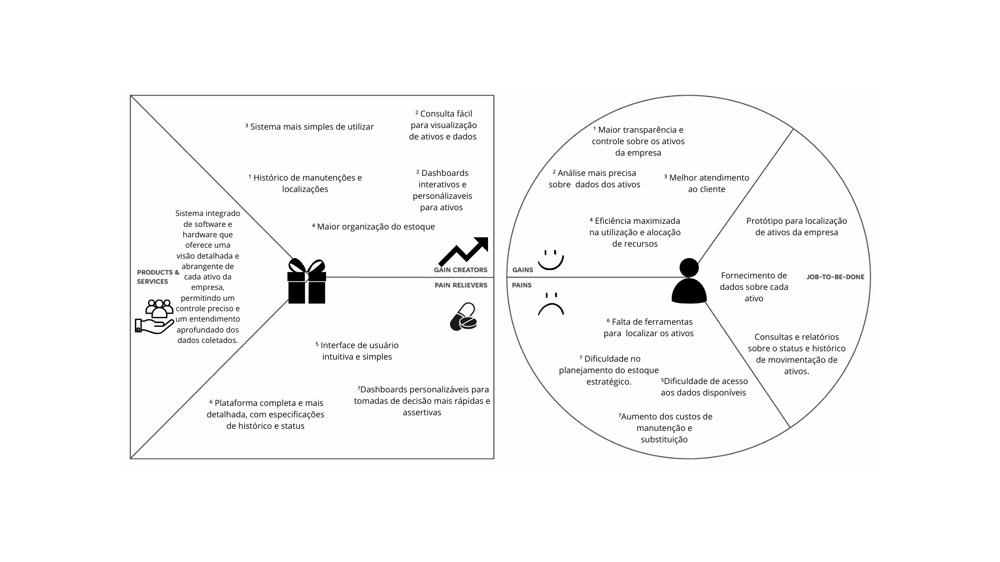
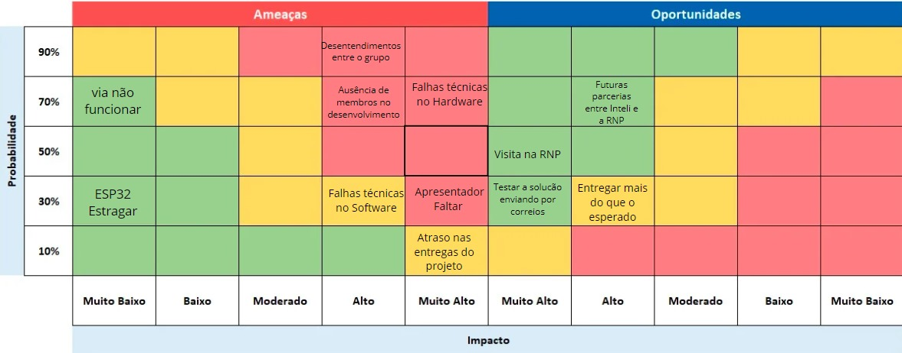
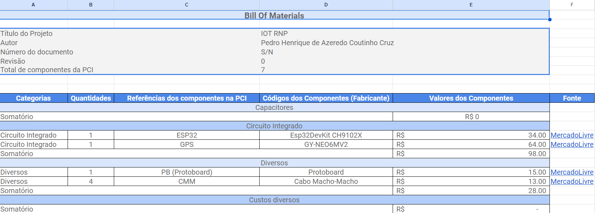
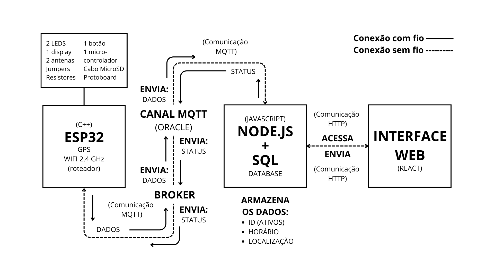
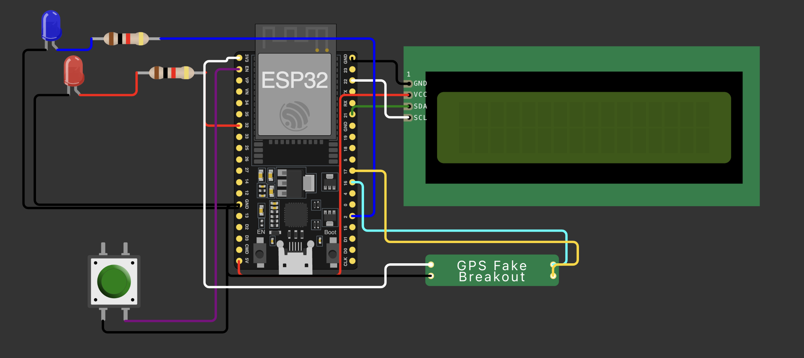
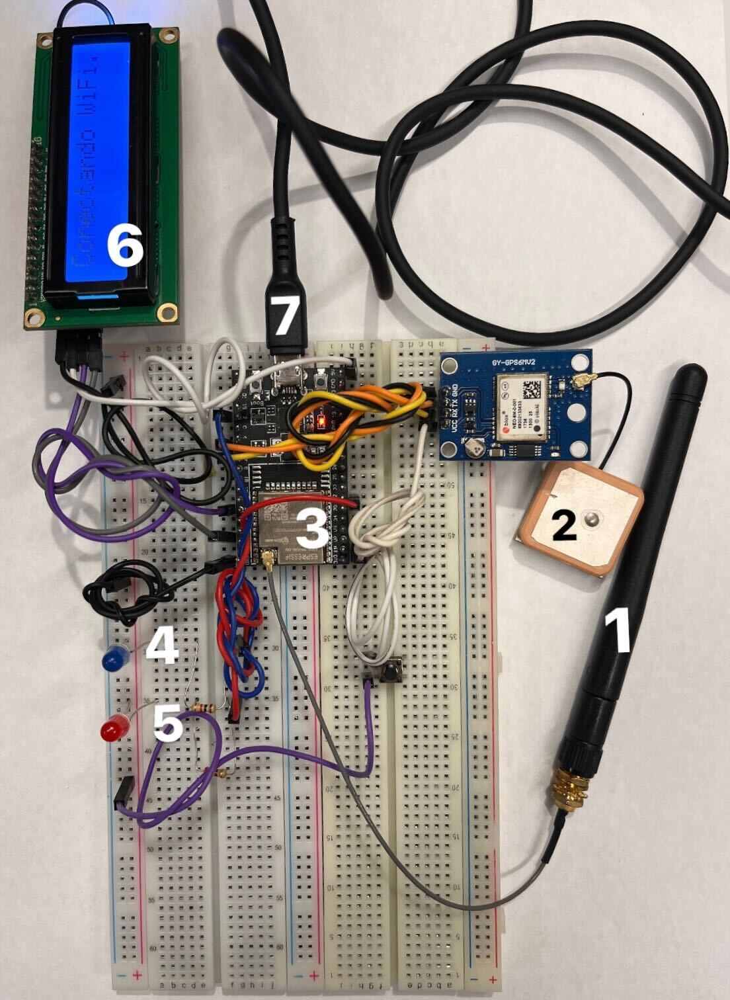
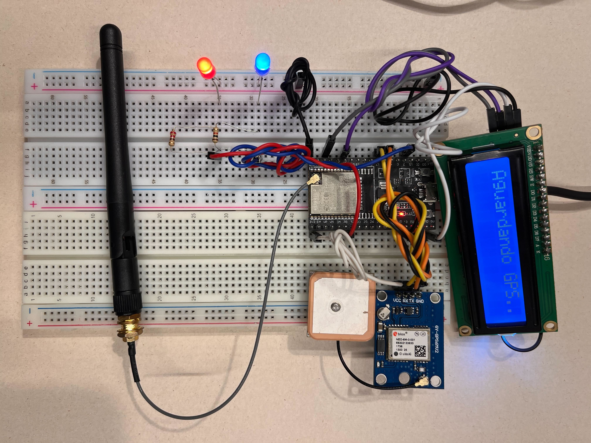
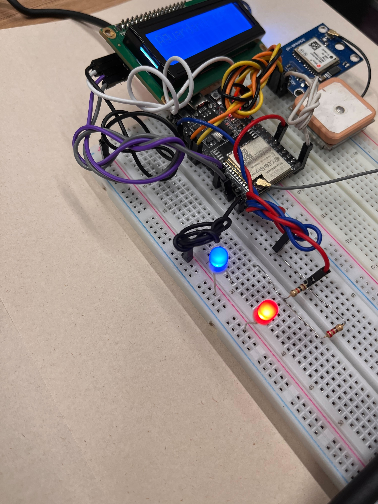
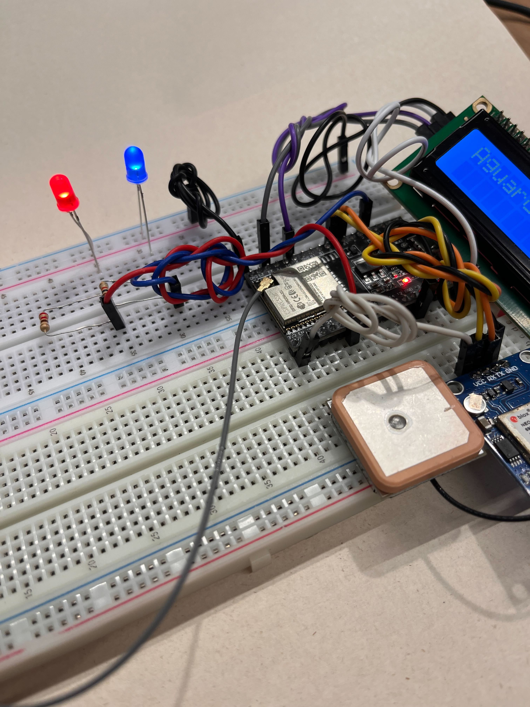
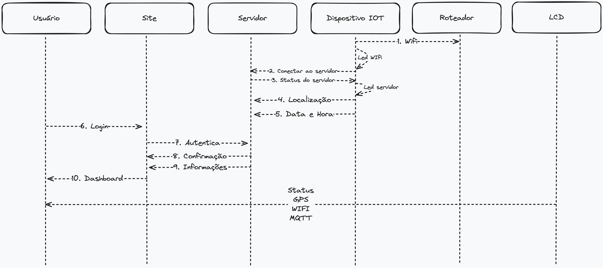

# Documentação IoTDoc - Módulo 4 - Inteli

## ORBIT

#### Nome dos integrantes
- <a href="https://www.linkedin.com/in/claramohammad/">Clara Coelho Mohammad</a>
- <a href="https://www.linkedin.com/in/gabriellysilvavitor/">Gabrielly Silva Vitor</a>
- <a href="https://www.linkedin.com/in/luan-ramos-de-mello-253b28268/">Luan Ramos de Melo</a>
- <a href="https://www.linkedin.com/in/marina-ladeira-867159269/">Marina Ladeira</a>
- <a href="https://www.linkedin.com/in/pedro-henrique-coutinho-cruz/">Pedro Cruz</a>
- <a href="https://www.linkedin.com/in/sophianobrega/">Sophia Nóbrega</a>

## Sumário

## Sumário

[1. Introdução](#1-introdução)
- [1.1 Objetivos](#11-objetivos)
- [1.2 Proposta da solução](12-proposta-da-solução)
- [1.3 Justificativa](#13-justificativa)

[2. Metodologia](#2-metodologia)

[3. Desenvolvimento e Resultados](#3-desenvolvimento-e-resultados)
- [3.1. Domínio de Fundamentos de Negócio](#31-domínio-de-fundamentos-de-negócio)
  - [3.1.1. Contexto da Indústria](#311-contexto-da-indústria)
  - [3.1.2. Análise SWOT](#312-análise-swot)
  - [3.1.3. Descrição da Solução a ser Desenvolvida](#313-descrição-da-solução-a-ser-desenvolvida)
  - [3.1.4. Value Proposition Canvas](#314-value-proposition-canvas)
  - [3.1.5. Matriz de Riscos](#315-matriz-de-riscos)
  - [3.1.6. Política de Privacidade de acordo com a LGPD](#316-política-de-privacidade-de-acordo-com-a-lgpd)
  - [3.1.7. Bill of Material (BOM)](#317-bill-of-material-(bom))
- [3.2. Domínio de Fundamentos de Experiência de Usuário](#32-domínio-de-fundamentos-de-experiência-de-usuário)
  - [3.2.1. Personas](#321-personas)
  - [3.2.2. Jornadas do Usuário](#322-jornadas-do-usuário)
  - [3.2.3. Storyboard](#323-storyboard)
  - [3.2.4. User Stories](#324-user-stories)
  - [3.2.5. Protótipo de interface com o usuário](#325-protótipo-de-interface-com-o-usuário)
- [3.3. Solução Técnica](#33-solução-técnica)
  - [3.3.1. Requisitos Funcionais](#331-requisitos-funcionais)
  - [3.3.2. Requisitos Não Funcionais](#332-requisitos-não-funcionais)
  - [3.3.4. Arquitetura da Solução](#334-arquitetura-da-solução)
  - [3.3.5. Arquitetura do Protótipo](#335-arquitetura-do-protótipo)
  - [3.3.6. Arquitetura Refinada da Solução](#336-arquitetura-refinada-da-solução)
- [3.4. Resultados](#34-resultados)
  - [3.4.1.Protótipo Inicial do Projeto usando o Simulador Wokwi](#341-protótipo-inicial-do-projeto-usando-o-simulador-wokwi)
  - [3.4.2. Protótipo Físico do Projeto (offline)](#342-protótipo-físico-do-projeto-(offline))
  - [3.4.3. Protótipo do Projeto com MQTT e I2C](#343-protótipo-do-projeto-com-mqtt-e-i2c)
  - [3.4.4. Protótipo Físico do Projeto (online)](#344-protótipo-físico-do-projeto-(online))
  - [3.4.5. Protótipo Final do Projeto](#345-protótipo-final-do-projeto)
  - [3.4.6. Testes de Usabilidade](#346-testes-de-usabilidade)

[4. Possibilidades de Descarte](#4-possibilidades-de-descarte)

[5. Conclusões e Recomendações](#5-conclusões-e-recomendações)

[6. Referências](#6-referências)

 

# 1. Introdução

&emsp;&emsp; No Módulo 4 de 2023, os alunos da Turma 8 do Inteli (Instituto de Tecnologia e Liderança) terão a parceria da RNP (Rede Nacional de Ensino e Pesquisa) no desenvolvimento de um projeto em IoT (Internet Of Things) integrada uma aplicação web intuitiva para os funcionários poderem ter o controle dos ativos da empresa espalhados pelo país.

&emsp;&emsp; A RNP é uma organização reconhecida por disponibilizar uma ampla gama de ferramentas que fomentam a comunicação, colaboração à distância, educação e a produção de conhecimento, atendendo não apenas todas as regiões do Brasil, mas também ultrapassando fronteiras internacionais.

&emsp;&emsp; O desafio para desenvolver o projeto em questão ocorre com o uso de ferramentas especialmente concebidas para realizar uma localização precisa de ativos, visando a redução de despesas e a otimização dos recursos, minimizando perdas. Portanto, para o desenvolvimento dessa solução é necessário unir o hardware com a parte de software.

## 1.1 Objetivos

&emsp;&emsp; O principal propósito deste projeto é desenvolver um protótipo de IoT destinado à localização dos ativos da RNP, distribuídos em todo o território brasileiro, tornando o processo de localização e identificação rápido e eficiente, com o intuito de reduzir perdas e despesas, além de contribuir para a eficácia no trabalho dos funcionários da empresa.

&emsp;&emsp; Para alcançar esse objetivo, será necessário criar uma interface intuitiva que permitirá aos usuários cadastrar informações dos ativos, consultar o histórico detalhado da localização dos ativos para controle e futuras manutenções, além de acessar informações também no mapa interativo.

&emsp;&emsp; Ademais será disponibilizado APIs para garantir uma maior flexibilidade de uso. Vale ressaltar que os principais beneficiários deste projeto serão os colaboradores da Diretoria de Engenharia e Operações da RNP, e todos os funcionários que precisarem acessar registros dos ativos de forma organizada e rápida.

## 1.2 Proposta da solução

&emsp;&emsp;A Rede Nacional de Ensino e Pesquisa (RNP) enfrenta desafios na gestão de seus ativos distribuídos em todo o Brasil. A proposta de solução para este projeto visa criar um sistema IoT abrangente para rastrear, monitorar e gerenciar esses ativos em tempo real, visando otimizar seu uso e aprimorar a eficiência operacional da empresa.

&emsp;&emsp;O sistema desenvolvido oferecerá um cadastro detalhado de ativos, incluindo informações como localização em tempo real, histórico de movimentação, endereço e nome do local onde o ativo está alocado. Além disso, apresentará um dashboard interativo que fornecerá informações e um sistema de filtro na barra de pesquisa. Essa solução proposta tem como objetivo melhorar significativamente a gestão de ativos da RNP.

## 1.3 Justificativa

&emsp;&emsp;A proposta de um sistema de localização e gestão de ativos para a RNP representa um marco significativo para a organização, permitindo aprimorar de maneira substancial a eficiência e eficácia de suas operações. À medida que a RNP continua a expandir sua presença geográfica e seu conjunto de ativos distribuídos em todo o país, a necessidade de um sistema centralizado e abrangente se torna premente. Esse sistema proporcionará à RNP a capacidade de registrar, rastrear e monitorar cada ativo em tempo real, fornecendo um panorama completo de sua infraestrutura.

&emsp;&emsp;Ao aprofundar a precisão e consistência dos dados, a organização pode tomar decisões mais embasadas e estratégicas. Além disso, a integração com o sistema ERP Protheus garante que a gestão de ativos esteja alinhada com as demais operações da RNP. A possibilidade de personalizar notificações e alertas permitirá que a equipe da RNP esteja ciente de transferências críticas de ativos e outras atividades em tempo real, reduzindo o risco de perda ou extravio.

&emsp;&emsp;A extensibilidade do sistema também oferece a flexibilidade de incorporar funcionalidades adicionais no futuro, mantendo a RNP preparada para enfrentar desafios em constante evolução. Em resumo, essa proposta é mais do que uma simples solução técnica; é uma abordagem estratégica para aprimorar a operação e a eficácia da RNP em sua missão vital de apoiar o ensino e a pesquisa em todo o Brasil.

 

# 2. Metodologia

&emsp; &emsp;Metodologia refere-se a um conjunto organizado de métodos e processos para realizar tarefas específicas, resolver problemas ou atingir objetivos. Geralmente proporciona uma abordagem padronizada, oferecendo diretrizes para a execução eficaz de atividades em diversos contextos, garantindo qualidade e consistência no desenvolvimento de um projeto.

&emsp; &emsp;A RM ODP é um Modelo de Referência para Objetos Distribuídos e Persistência, fornecendo uma estrutura organizada de processos para o desenvolvimento de soluções. Essa metodologia é crucial para garantir a eficácia do projeto, assegurando coesão e eficiência na integração de componentes. A RM ODP se fez presente em cada processo do desenvolvimento dessa solução:

 

**TECNOLOGIA (tecnologias utilizadas)**
| -------------------------- |

&emsp; &emsp;A solução integrada para a Rede Nacional de Ensino e Pesquisa (RNP) visa automatizar a análise dos ativos, proporcionando uma gestão eficiente por meio da integração de tecnologias avançadas. A solução é um IoT, com destaque para o emprego de módulos Arduino, programação em C++, GPS, MQTT, Wifi e um broker Mosquitto para comunicação. O sistema incorpora uma plataforma intuitiva desenvolvida utilizando React e JavaScript para o Front-End para o Back-End são utilizados Node.js e SQL.

&emsp; &emsp;Os dispositivos IoT, equipados com sensores e módulos GPS, coletam dados em tempo real sobre os ativos, transmitindo as informações por meio do protocolo MQTT via conexão Wifi. Esses dados são enviados para um tópico gerenciado pelo Broker que está numa instância na cloud Oracle, então o backend em Node.js conecta nesse tópico, coleta as informações postadas e insere no banco de dados proporcionando uma base de infraestrutura sólida para as comunicações.

&emsp; &emsp;A plataforma web, desenvolvida em React e JavaScript, utilizando também Node.js e SQL oferece uma interface intuitiva para os usuários da RNP, permitindo o acompanhamento em tempo real e a análise histórica dos ativos. A utilização de C++ na programação dos módulos Arduino garante a eficiência na exibição de informações cruciais de forma clara e concisa.

&emsp; &emsp;A solução não apenas automatiza a coleta de dados, mas também facilita a interação dos funcionários por meio de consultas simples e relatórios personalizados. Além disso, a integração de tecnologias como MQTT, Wifi, e Oracle assegura uma comunicação e confiabilidade na gestão dos ativos para a RNP.

 

**ARQUITETURA (agnóstica a tecnologia)**
| -------------------------- |

&emsp; &emsp;A solução integrada para a Rede Nacional de Ensino e Pesquisa (RNP) tem como objetivo aprimorar a gestão dos ativos em instituições parceiras em todo o Brasil, promovendo eficiência por meio da integração de métodos avançados. Ao adotar uma abordagem de Internet das Coisas (IoT), a solução realiza a coleta em tempo real de dados sobre os ativos, centralizando as informações em um banco de dados robusto para análises futuras.

&emsp; &emsp;A plataforma web proporciona uma interface intuitiva e um mapa interativo para o acompanhamento em tempo real e análise da movimentação dos ativos, com base em um histórico consolidado. Adicionalmente, um sistema de filtragem simplifica a interação dos usuários, permitindo consultas personalizadas. Essa abordagem visa automatizar a coleta de dados e aprimorar a gestão dos ativos, priorizando a eficiência no âmbito operacional da RNP.

 

**REQUISITOS FUNCIONAIS (funcionalidades)**
| -------------------------- |

&emsp; &emsp;A solução integrada de IoT desenvolvida para a Rede Nacional de Ensino e Pesquisa (RNP) apresenta uma série de requisitos funcionais essenciais para garantir o monitoramento eficiente e a gestão inteligente dos ativos. A seguir, destacam-se as principais funcionalidades desta solução:

<h6 align="center"> Tabela 1: Requisitos Funcionais - RM ODP </h6>

| Funcionalidade | Descrição |
| -------------- | --------- |
| 1. Localização de Ativos com Data e Hora: | Sistema que rastreia a posição geográfica de cada ativo em tempo real, registrando informações precisas sobre sua localização e horário. |
| 2. Coleta de Dados Detalhada: | Utilização de dispositivos IoT dedicados a cada ativo para coleta de informações essenciais, como data de validade, modelo, local, projeto e status. |
| 3. Consultas e Relatórios de Status e Histórico de Movimentação dos Ativos: | Funcionalidade que permite a realização de consultas e a geração de relatórios detalhados e dashboards sobre o último status e o histórico de movimentação de cada ativo. Além disso, há disponibilidade de filtros que permitem análises mais específicas. |
|4. Cadastro, Edição e Remoção Manual de Ativos: | Interface que possibilita o cadastro inicial, edição de informações e remoção de ativos de forma manual, oferecendo flexibilidade no gerenciamento da base de dados. |
| 5. Dashboard Personalizado com Visualizações Gráficas: | Desenvolvimento de um painel visual intuitivo que apresenta o status dos ativos por meio de gráficos, proporcionando uma visão rápida e clara das informações. |
|6. Monitoramento Remotamente do Microcontrolador: | Capacidade de gerenciar remotamente cada microcontrolador associado a um ativo. |
| 7. Manutenção da Saúde do Dispositivo: | Monitoramento contínuo da saúde de cada dispositivo de acordo com análise do histórico de manutenções. |
|8. Envio de Dados para Banco de Dados Centralizado: | Transferência segura e automática dos dados coletados para um banco de dados centralizado, possibilitando análises abrangentes e centralizadas.|
| 9. Visualização de Localidade por Mapas Interativos: | Integração de mapas interativos para visualização precisa da localização de cada ativo, facilitando o acompanhamento logístico e estratégico. A visualização dos gráficos e mapas deve ser acessível para pessoas com daltonismo.|
| 10. Filtragem e Pesquisa Avançadas: | Implementação de ferramentas de filtragem e pesquisa que permitem a localização rápida e eficiente de ativos específicos dentro do sistema. |

<h6 align="center"> Fonte: Elaborado por Gabrielly Vitor </h6>

&emsp; &emsp;Portanto, é viável realizar uma análise abrangente dos requisitos funcionais, estabelecendo conexões precisas e complementares com cada funcionalidade do sistema. Essa abordagem garante não apenas a integralidade operacional completa da solução desenvolvida para a RNP, mas também assegura que cada requisito seja atendido de maneira eficaz, contribuindo para o sucesso global do projeto.

 

**REQUISITOS NÃO FUNCIONAIS**
| -------------------------- |

&emsp; &emsp;Quando falamos sobre os "requisitos não funcionais" na gestão dos ativos da Rede Nacional de Ensino e Pesquisa (RNP), estamos abordando aspectos além das funções diretas do sistema. Esses requisitos envolvem coisas como quão rápido o sistema precisa ser, o quão seguro é e o quão fácil é manter tudo funcionando sem problemas.

&emsp; &emsp;Para a RNP, isso significa não apenas garantir que o sistema faça o que é necessário, mas também que seja confiável, seguro e fácil de usar. Estabelecer esses requisitos não funcionais é uma etapa crucial para garantir que a infraestrutura da RNP continue contribuindo para o progresso da pesquisa e educação no Brasil.

<h6 align="center"> Tabela 2: Requisitos Não Funcionais - RM ODP </h6>

| Classificação | Descrição |
| ----------------- | --------- |
| RNF1 | O projeto requer a implementação de um microcontrolador dedicado para receber dados do GPS e transmiti-los de forma eficiente para o banco de dados. |
| RNF2 | A aplicação web deve apresentar a localização e dados de cada ativo em um mapa interativo, com uma visualização clara para auxiliar os colaboradores nas tomadas de decisão. |
| RNF3 | A solução deve atualizar o dashboard a cada 30 segundos, garantindo informações em tempo real e suportando decisões ágeis. |
| RNF4 | O serviço deve ser projetado com uma interface amigável, considerando usuários de diversas gerações, desde aqueles não familiarizados com tecnologias modernas, como as gerações Z, garantindo facilidade de uso com comandos claros e uma linguagem acessível, mas não simplista. |
| RNF5 | As cores do software devem ser cuidadosamente selecionadas para garantir contraste, facilitando a visualização para usuários com deficiência visual. Essa abordagem inclusiva promove uma experiência mais acessível e amigável para todos os usuários. |

<h6 align="center"> Fonte: Elaborado por Gabrielly Vitor </h6>

&emsp; &emsp;Assim, torna-se possível analisar todas as funcionalidades que o sistema deve executar, estabelecendo conexões precisas e complementares com cada requisito funcional. Além de garantir a integralidade operacional completa da solução desenvolvida para a RNP.

 

**DEMANDA DE NEGÓCIOS (problema/demanda de negócio)**
| -------------------------- |

&emsp; &emsp;A RNP apresentou um desafio intrigante no quarto módulo: a dificuldade no rastreamento de ativos da empresa e a carência de automatização em processos repetitivos. Em resposta a essa questão, a Orbit propôs uma solução inovadora, que consiste em um dispositivo IoT acompanhado por uma aplicação web. Essa abordagem visa facilitar, de maneira abrangente e intuitiva, o acompanhamento dos ativos pela RNP.

&emsp; &emsp;É crucial destacar o cuidado da equipe em utilizar uma linguagem acessível e clara, aliado a diversas estratégias para garantir uma navegação fácil. O objetivo é assegurar que todos os funcionários da RNP possam acessar a solução com facilidade, proporcionando uma experiência positiva. No desenvolvimento das personas, a inclusividade foi uma prioridade, contemplando uma persona com daltonismo, garantindo que a aplicação seja acessível a todos.

&emsp; &emsp;Além do foco no usuário final, a equipe considerou os impactos nos processos internos da empresa. Portanto, o dashboard desenvolvido possui funcionalidades destinadas a otimizar o dia a dia da empresa, eliminando tarefas repetitivas, como o acompanhamento de múltiplas entregas em diferentes sites ou a necessidade constante de entrar em contato com os responsáveis.

&emsp; &emsp;Dessa forma, a solução proposta pela Orbit para a RNP não apenas promete auxiliar os usuários finais, mas também visa aprimorar efetivamente os processos internos da empresa como um todo, atendendo plenamente à demanda apresentada. Destaca-se que essa melhoria nos processos resulta em eficiência operacional, redução de custos e, consequentemente, um impacto positivo nos negócios da RNP, fortalecendo sua posição no mercado e contribuindo para um crescimento sustentável.

 

# 3. Desenvolvimento e Resultados
&emsp;&emsp;Neste tópico, exploraremos o processo completo de desenvolvimento do projeto, começando pela compreensão do negócio do parceiro. Abordaremos todas as etapas, incluindo a elaboração do protótipo físico e a análise dos resultados obtidos nos testes. Essa abordagem abrangente visa garantir uma visão holística e eficiente do ciclo de vida do projeto, integrando aspectos de entendimento do negócio, desenvolvimento de protótipos e validação por meio de testes.

## 3.1. Domínio de Fundamentos de Negócio

&emsp;&emsp;O domínio dos fundamentos de negócio é essencial para o sucesso em qualquer empreendimento. Compreender os princípios básicos que regem o mundo dos negócios é como construir uma base sólida para a tomada de decisões informadas. Isso inclui uma compreensão profunda dos conceitos de oferta e demanda, gestão financeira, estratégias de marketing e análise de mercado, entre outros. Dominar esses fundamentos não apenas permite que os empresários evitem armadilhas comuns, mas também lhes dá a capacidade de identificar oportunidades de crescimento e inovação. Em resumo, o conhecimento sólido dos fundamentos de negócio é um trunfo valioso para qualquer profissional que deseje prosperar no mundo empresarial.

### 3.1.1. Contexto da Indústria

&emsp;&emsp;Na era da informação e da conectividade, a indústria de telecomunicações desempenha um papel fundamental na construção de uma sociedade interligada e na habilitação de inúmeras inovações tecnológicas. À medida que a demanda por serviços de telecomunicações continua a crescer, compreender o contexto e a dinâmica da indústria se torna cada vez mais crucial. Desde a infraestrutura de rede até a entrega de serviços finais aos clientes, a cadeia de valor desse setor envolve uma série de elementos interligados que influenciam nossa forma de comunicação, trabalho, entretenimento e muito mais. Para tomar decisões informadas, desenvolver estratégias de negócios eficazes e antecipar as tendências do mercado, é essencial explorar e compreender profundamente o cenário da indústria de telecomunicações.

**Principais Players do Mercado:**

1. **Operadoras de Telecomunicações**: Empresas como Vivo, Claro, Oi e TIM, entre outras, fornecem serviços de telecomunicações em todo o Brasil, incluindo conectividade de internet. Embora seu foco principal seja o mercado comercial, algumas delas também fornecem serviços para instituições de ensino e pesquisa.
2. **Provedores de Serviços de Internet (ISPs)**: Existem vários provedores de serviços de internet no Brasil, que variam em tamanho e alcance geográfico. Alguns deles oferecem serviços de banda larga para instituições acadêmicas e de pesquisa, podemos citar a Alloha Fibra
3. **Instituições de Ensino e Pesquisa**: Algumas universidades e institutos de pesquisa no Brasil desenvolvem suas próprias infraestruturas de rede e serviços de conectividade, o que pode criar concorrência indireta com os serviços oferecidos pela RNP em seus campus.
4. **Empresas de Tecnologia da Informação**: Empresas de TI no Brasil podem oferecer serviços relacionados à infraestrutura de rede, incluindo a implementação de redes locais, data centers e serviços de gerenciamento de rede para instituições acadêmicas.

#### Análise Setorial de Telecomunicações:

&emsp;&emsp;O mercado de telecomunicações no Brasil apresenta um valor significativo, atingindo cerca de US$ 45,76 bilhões e experimentando um crescimento constante de 5% ao ano. Esse setor é composto por uma complexa cadeia de valor, onde cada etapa desempenha um papel fundamental no fornecimento de serviços de telecomunicações.

&emsp;&emsp;Sobre a cadeia do setor, temos a infraestrutura de rede, onde existem possíveis oportunidades para fornecer em primeira mão as novas tecnologias de rede. Além disso, temos a fabricação de equipamentos, o que representa uma área que a RNP pode explorar com base em projetos desenvolvidos. A seguir, encontramos o fornecimento de serviços de rede, especialmente para faculdades e escolas, a operação de rede e manutenção, provedores de serviços, clientes finais e, em um estágio posterior, desenvolvedores de conteúdo e aplicativos, juntamente com revendedores e distribuidores.

&emsp;&emsp;É importante notar que, no setor de telecomunicações, as transições de uma geração de tecnologia para outra (por exemplo, de 3G para 4G ou de 4G para 5G) frequentemente introduzem ciclos de inovação e crescimento, intercalados com as fases de maturidade e declínio em serviços mais antigos. Além disso, a convergência de serviços, como pacotes de telecomunicações que incluem Internet, TV e telefonia, tem influenciado o ciclo de mercado, à medida que as empresas buscam diversificar e manter a fidelidade do cliente.

&emsp;&emsp;A dinâmica do ciclo de mercado de telecomunicações é influenciada por fatores como avanços tecnológicos, mudanças nas preferências dos consumidores, regulamentações governamentais e pressões econômicas. As empresas do setor precisam estar atentas a essas mudanças e adaptar suas estratégias de acordo com a fase em que se encontram para se manterem competitivas.

#### Análise Ambiental Externa

&emsp;&emsp;A análise ambiental externa é um componente fundamental para o sucesso de qualquer organização, pois permite que ela compreenda o contexto no qual está inserida. Essa análise envolve a avaliação de fatores econômicos, políticos, sociais, tecnológicos e ambientais que podem impactar diretamente as operações e estratégias de uma empresa. Ao entender a dinâmica do ambiente externo, a organização se torna mais capaz de antecipar mudanças, identificar oportunidades e ameaças, e adaptar-se de maneira proativa, o que é crucial para a sua sobrevivência e crescimento no mercado competitivo atual.

&emsp;&emsp;Além disso, a análise ambiental externa desempenha um papel crucial na definição de metas e objetivos de longo prazo. Ela permite que a empresa identifique tendências emergentes, preferências do consumidor, regulamentações governamentais e movimentos de mercado que podem influenciar diretamente suas decisões estratégicas. Portanto, ao reconhecer a importância da análise ambiental externa, as organizações podem se posicionar de forma mais sólida no mercado, planejar estratégias mais eficazes e, em última instância, alcançar o sucesso sustentável.

##### Sócio-cultural:

&emsp;&emsp;A maioria dos brasileiros reconhece os serviços de telecomunicações, como telefonia móvel e internet, como necessidades fundamentais na vida cotidiana. Eles são usados para comunicação, acesso a informações, trabalho, educação e entretenimento.

&emsp;&emsp;Além disso, muitos consumidores podem ter preocupações sobre os preços dos serviços de telecomunicações, considerando que as tarifas nem sempre são acessíveis a todos os estratos da sociedade. Além disso, a qualidade dos serviços pode variar, dependendo da região e da operadora, o que pode gerar insatisfação.

&emsp;&emsp;A expansão da banda larga é vista como uma necessidade para muitos, especialmente com o aumento do trabalho e educação remotos. As áreas rurais e menos desenvolvidas podem considerar o acesso à banda larga de alta velocidade como um fator de desenvolvimento essencial.

&emsp;&emsp;Por isso, a implantação da tecnologia 5G é vista com interesse e entusiasmo, pois promete maior velocidade de conexão e suporte a novas aplicações, como Internet das Coisas (IoT) e automação. A sociedade vê isso como uma oportunidade para avançar em áreas como tecnologia, saúde e educação.

&emsp;&emsp;No geral, o setor de telecomunicações é reconhecido por seu impacto positivo na economia, incluindo a criação de empregos, o estímulo à inovação e a capacidade de impulsionar o crescimento de outros setores.

##### Demográfico:

&emsp;&emsp;O Brasil é um país com uma grande população, com mais de 211 milhões de habitantes em 2022. Esse tamanho da população oferece um vasto mercado para serviços de telecomunicações.

&emsp;&emsp;Além disso, a maioria da população brasileira reside em áreas urbanas, o que contribui para a demanda por serviços de telecomunicações em cidades e regiões metropolitanas.

&emsp;&emsp;Mas infelizmente o Brasil apresenta desigualdades significativas em termos de infraestrutura de telecomunicações, acesso à internet e serviços móveis. As áreas urbanas tendem a ter melhor acesso, enquanto áreas rurais e regiões menos desenvolvidas enfrentam desafios de conectividade.

##### Global:

&emsp;&emsp;A implantação da tecnologia 5G está em andamento em muitas partes do mundo. As empresas de telecomunicações estão investindo em infraestrutura 5G para oferecer maior velocidade de conexão, menor latência e suporte a aplicações avançadas, como IoT (Internet das Coisas) e veículos autônomos.

&emsp;&emsp;Também temos a expansão de redes de fibra óptica para fornecer serviços de banda larga de alta velocidade é uma prioridade em muitos países. A fibra óptica oferece maior capacidade e desempenho em comparação com tecnologias mais antigas.

&emsp;&emsp;Por ultimo, as empresas de telecomunicações estão constantemente buscando inovações, como serviços em nuvem, soluções de segurança e novos modelos de negócios, para permanecerem competitivas em um mercado em constante evolução.

##### Tecnológico:

&emsp;&emsp;O cenário tecnológico para o setor de telecomunicações está em constante evolução, impulsionado por avanços tecnológicos e inovações que moldam a forma como as empresas de telecomunicações operam e entregam serviços aos seus clientes. Aqui estão algumas das tendências e desenvolvimentos tecnológicos mais relevantes nesse cenário: 5G, virtualização de funções de rede (NFV), redes definidas por software (SDN), fibra óptica, egde compulting, IoT (internet das coisas), IA (inteligência artificial), aprendizado de maquina, segurança cibernética avançada, internet de alta velocidade via satélite, redes privadas e edge compulting empresarial, blockchain, e energia e sustentabilidade.

##### Político/legal:

&emsp;&emsp;A neutralidade da rede é um princípio regulatório que exige que as operadoras de telecomunicações tratem todos os dados e tráfego de maneira igualitária, sem discriminação. A questão da neutralidade da rede continua a ser debatida em muitos países e pode afetar a maneira como as empresas gerenciam o tráfego de dados e oferecem serviços aos clientes.

&emsp;&emsp;Dentro das coisas que afetam o cenário político-social, também temos as regulamentações de privacidade de dados e proteção de informações pessoais dos clientes têm se tornado cada vez mais rigorosas. As empresas de telecomunicações devem cumprir essas regulamentações e garantir a segurança dos dados dos clientes.

&emsp;&emsp;Em alguns países, as agências reguladoras podem regular os preços de serviços de telecomunicações para garantir que sejam justos e acessíveis.

&emsp;&emsp;Além do governo pode estabelecer normas técnicas e de qualidade que as operadoras de telecomunicações devem cumprir para garantir a qualidade dos serviços.

##### Econômico:

&emsp;&emsp;A capacidade de investir em infraestrutura é fundamental para as empresas de telecomunicações. A expansão e atualização das redes exigem investimentos significativos em equipamentos, tecnologia e mão de obra.

&emsp;&emsp;Também a competição no setor de telecomunicações muitas vezes leva à pressão sobre os preços dos serviços. As empresas devem encontrar maneiras de equilibrar preços acessíveis para os consumidores com a necessidade de manter margens de lucro saudáveis.

&emsp;&emsp;Sem contar que a inovação é essencial para expandir as ofertas de serviços e criar novas fontes de receita. Isso inclui serviços de valor agregado, como streaming de vídeo, IoT e soluções empresariais.

&emsp;&emsp;Mas apesar de qualquer coisa, a capacidade de se adaptar a desafios econômicos, como recessões, é uma consideração importante para as empresas de telecomunicações.

#### Cinco Forças de Porter:

&emsp;&emsp;As cinco forças de Porter desempenham um papel fundamental na análise e compreensão do ambiente competitivo de uma empresa. Ao examinar o poder dos fornecedores e dos compradores, a ameaça de novos concorrentes, a rivalidade existente no setor e a influência de produtos substitutos, as organizações podem tomar decisões estratégicas mais informadas. Essa estrutura fornece insights valiosos para a formulação de estratégias que visam à competitividade e à sustentabilidade de negócios, ajudando a identificar oportunidades e ameaças que moldam o sucesso ou fracasso no mercado.

<h6 align="center"> Figura 1:  Cinco Forças de Porter </h6>

<h6 align="center"> Fonte: Elaborado por Sophia Nóbrega </h6>

##### Ameaça de produtos substitutos:

&emsp;&emsp;**Proximidade de substitutos:** A proximidade de substitutos no setor de telecomunicações é relativamente **baixa** devido à necessidade contínua de serviços de comunicação e conectividade.

&emsp;&emsp;**Preço/valor do substituto:** Os produtos substitutos dos serviços de telecomunicações incluem serviços de comunicação por meio de aplicativos de mensagens e chamadas pela Internet, que muitas vezes oferecem custos mais baixos em relação ao valor percebido, ou seja, **baixo**.

&emsp;&emsp;**Custo de mudança:** O custo de mudança para um produto substitutivo para o cliente de telecomunicações pode variar, mas geralmente inclui despesas associadas à aquisição de novos dispositivos, contratos e serviços, bem como possíveis interrupções na conectividade e na transferência de dados. Portanto, para um cliente comum, é um custo **alto**.

&emsp;&emsp;Conclusão, considerando que a proximidade é baixa, a relação preço/valor também e o custo para o cliente, alto. Consideramos que a ameaça de produtos substitutos é **baixa**, já que o cenário não é favorável para esse tipo de negócio.

##### Novos entrantes:

&emsp;&emsp;**Barreiras à entrada:** A principal barreira de entrada no setor de telecomunicações é o **alto** custo inicial associado à construção e expansão da infraestrutura de rede e a obtenção de licenças de operação e espectro de frequência.

&emsp;&emsp;**Economia de escala:** A economia de escala no setor de telecomunicações refere-se à redução dos custos médios de produção à medida que as empresas expandem suas operações e atendem a um número maior de clientes, resultando em eficiência e maior rentabilidade.

&emsp;&emsp;Uma empresa nesse setor, para atingir os requisitos que permitem a escala de sua receita, precisa ser ou muito inovadora, ou ter um poder aquisitivo muito grande junto de uma equipe super bem preparada e pesquisadora. Por esses motivos, consideramos que a economia de escala nesse setor é **baixa**.

&emsp;&emsp;**Diferenciação do produto:** A capacidade de fornecer serviços de telecomunicações confiáveis, inovadores e de alta qualidade, adaptados às necessidades dos clientes, é o que diferencia uma empresa no setor de telecom. Por isso, acreditamos que não é muito difícil se diferenciar no setor, ou seja, o poder de diferenciação é **alta**.

&emsp;&emsp;**Necessidades de Capital:** A necessidade de capital do setor de telecom é impulsionada pela expansão da infraestrutura de rede, investimentos em tecnologia, atualizações constantes e manutenção, visando atender à crescente demanda por serviços de comunicação e conectividade, por isso consideramos **alta**.

&emsp;&emsp;**Acesso à distribuição:** O acesso à distribuição no setor de telecomunicações varia de acordo com a localização geográfica, sendo alto nas áreas urbanas, médio em algumas áreas rurais e baixo em regiões remotas e menos desenvolvidas, ou seja, depende.

&emsp;&emsp;**Curva de Experiência:** A curva de experiência no setor de telecomunicações representa a redução de custos e aprimoramento da eficiência que as empresas alcançam à medida que adquirem mais experiência na construção e operação de infraestruturas de telecomunicações, resultando em serviços mais acessíveis para os consumidores, juntando com a necessidade de capital para isso e a barreira de entrada, diríamos que é **baixa** para novos entrantes.

&emsp;&emsp;**Política Governamental:** A política governamental no setor de telecomunicações visa regulamentar e promover a expansão da conectividade, garantir a concorrência justa, proteger os direitos dos consumidores e abordar as desigualdades no acesso à tecnologia.

&emsp;&emsp;**Retaliação:** A retaliação no setor de telecomunicações refere-se às ações que empresas tomam em resposta a práticas anticoncorrenciais, como preços predatórios ou concorrência desleal, a fim de proteger seus interesses e manter a competitividade.

&emsp;&emsp;Considerando que a barreira de entrada é alta, a economia de escala baixa e a curva de experiência também, diríamos que as chances de novos entrantes é **baixa**.

##### Poder de negociação dos clientes:

&emsp;&emsp;**Concentração dos compradores:** A concentração dos compradores no setor de telecomunicações é geralmente **baixa**, uma vez que os consumidores têm várias opções de provedores e serviços, o que limita o poder de barganha individual.

&emsp;&emsp;**Ameaça de integração para trás:** A ameaça de integração para trás nesse setor é representada pela entrada de empresas de tecnologia ou conteúdo que buscam controlar a infraestrutura de rede, ameaçando o poder e a posição das operadoras tradicionais.

&emsp;&emsp;**Sensibilidade ao preço:** A sensibilidade ao preço no setor de telecomunicações é geralmente **alta**, com os consumidores sendo influenciados por preços competitivos e ofertas atrativas.

&emsp;&emsp;**Custo de mudança:** O custo de mudança é frequentemente **alto**, devido aos investimentos substanciais em infraestrutura e à complexidade das operações.

&emsp;&emsp;**% do custo/renda:** A porcentagem do custo em relação à renda do público no setor de telecomunicações pode variar amplamente, mas em muitos casos, a despesa com telecomunicações é considerada uma parcela significativa da renda do público, o que pode ser classificado como uma relação de custo/**alto** rendimento.

&emsp;&emsp;**Informação:** O nível de informação do público no setor de telecomunicações varia amplamente, indo de médio a **alto**, com muitas pessoas conscientes dos serviços, mas com variações na compreensão das complexidades técnicas e regulatórias.

&emsp;&emsp;Em resumo, com a concentração baixa, a sensibilidade ao preço alta, a relação custo/renda alto e informação alta, podemos dizer que o poder de negociação dos clientes é **alto**.

##### Poder de negociação dos fornecedores:

&emsp;&emsp;**Concentração dos fornecedores:** A concentração normal de fornecedores em uma empresa de telecomunicações varia, mas geralmente envolve uma variedade de fornecedores para equipamentos, infraestrutura, serviços e componentes essenciais para operações de rede. (Alta)

&emsp;&emsp;**Produto exclusivo:** A RNP (Rede Nacional de Ensino e Pesquisa) oferece infraestrutura e serviços de rede avançados dedicados à educação e pesquisa no Brasil. (Sim, é um produto exclusivo)

&emsp;&emsp;**Diferenciação:** O diferencial da RNP (Rede Nacional de Ensino e Pesquisa) está em sua missão de prover infraestrutura de rede e serviços avançados de comunicação para instituições acadêmicas e de pesquisa no Brasil, impulsionando a inovação e a colaboração no ambiente educacional e científico. (Um diferencial significativo comparado aos concorrentes)

&emsp;&emsp;**Substitutos:** Os serviços substitutos da RNP incluem soluções de conectividade e infraestrutura de rede oferecidas por outras empresas de telecomunicações e provedores de serviços de internet. (Basicamente os concorrentes de varejo)

&emsp;&emsp;**Insumo relevante:** Os insumos relevantes para a RNP (Rede Nacional de Ensino e Pesquisa) incluem infraestrutura de rede, equipamentos de comunicação, tecnologia de informação, recursos humanos qualificados e parcerias acadêmicas e governamentais. (Muitos)

&emsp;&emsp;**Custo de Mudança:** O custo médio de mudança de fornecedor no setor de telecomunicações pode variar, mas geralmente envolve despesas associadas à aquisição de novos equipamentos, configuração de serviços e interrupções temporárias durante a transição.

&emsp;&emsp;Por mais que a o setor de telecomunicações tenha uma concentração de fornecedores alta, players grandes e dependa de muitos insumos, a RNP possui uma missão forte e relevante para contornar esses desafios e diminuir os custos de mudança, graças a sua atitude de investir em pesquisa e projetos acadêmicos, podendo internaliza-los e ganhar com isso.

&emsp;&emsp;Portanto, acreditamos que o poder de negociação dos fornecedores com a RNP seja **baixo**.

##### Concorrência:

&emsp;&emsp;**Concentração:** A concentração da concorrência no setor de telecomunicações muitas vezes envolve um pequeno número de grandes empresas que dominam o mercado, o que pode limitar a competição e afetar os preços e a qualidade dos serviços. (Ou seja, pouco players, mas gigantes)

&emsp;&emsp;**Custos fixos altos:** Os custos fixos mais altos do setor de telecomunicações geralmente estão relacionados à infraestrutura de rede, incluindo a manutenção e expansão de torres, cabos de fibra óptica e equipamentos de rede.

&emsp;&emsp;**Excesso de capacidade:** O risco de excesso de capacidade no setor de telecomunicações varia de acordo com a região e o mercado específico, mas geralmente é considerado médio. Isso ocorre porque, embora haja uma crescente demanda por dados e conectividade, a capacidade de investimento das empresas de telecomunicações e o ritmo de adoção de novas tecnologias, como o 5G, podem influenciar a magnitude desse risco em cada mercado. Além disso, a competição e as mudanças nas preferências do consumidor também desempenham um papel na determinação desse risco.

&emsp;&emsp;**Ausência de crescimento:** O tamanho do risco de ausência de crescimento no setor de telecomunicações pode variar de moderado a significativo, dependendo da capacidade das empresas de se adaptarem a novas demandas tecnológicas, à concorrência e ao ambiente regulatório, afetando sua sustentabilidade a longo prazo e o acesso da sociedade a serviços de comunicação avançados.

&emsp;&emsp;No caso da RNP, diríamos que o tamanho desse risco é médio, já que eles investem em tecnologias novas e pesquisa, mas também dependem da capacidade de infraestrutura a ser explorada no Brasil.

&emsp;&emsp;**Ausência de patentes:** No caso desse risco especifico, a RNP pode ter algum problema graças a quantidade de projetos que eles participam e patrocinam. Ou seja, pode ser que algum projeto não seja patenteado e isso gere algum problema para a empresa. (Médio/Existente)

&emsp;&emsp;**Ausência de diferenciação:** O risco da ausência de diferenciação no setor de telecomunicações é a perda de competitividade e margens de lucro, uma vez que os clientes podem optar por fornecedores com ofertas mais distintas e atrativas. Ou seja, como a RNP tem poucos concorrentes diretos, diríamos que esse risco é Baixo.

&emsp;&emsp;**Barreiras à saída:** As barreiras de saída do setor de telecomunicações incluem altos investimentos em infraestrutura, regulamentações governamentais complexas e a necessidade de manter a satisfação do cliente em um mercado altamente competitivo. (Alta)

&emsp;&emsp;Considerando que a concorrência é considerada alta, o excesso de capacidade baixo, a ausência de patente existente e os custos fixos altos, mas a barreira de saída sendo altíssima, o risco de não diferenciação baixo e a ausência de crescimento dependente, consideramos que esse tópico tem um risco **médio.**

### 3.1.2. Análise SWOT

&emsp;&emsp;A análise SWOT, que examina os pontos fortes, pontos fracos, oportunidades e ameaças de uma organização, desempenha um papel fundamental no planejamento estratégico. Ela oferece uma visão abrangente e estruturada do ambiente interno e externo da empresa, permitindo a identificação de direções estratégicas mais eficazes. Ao destacar as áreas onde a empresa pode capitalizar suas forças e oportunidades, bem como mitigar suas fraquezas e ameaças, a análise SWOT ajuda a tomar decisões informadas e alicerçadas, contribuindo para o sucesso e a sustentabilidade dos negócios.

<h6 align="center"> Figura 2:  Análise SWOT </h6>

<h6 align="center"> Fonte: Elaborado por Sophia Nóbrega </h6>

#### Forças:

1. **Portfólio de Produtos Diversificado:** A empresa possui um portfólio de produtos abrangente, incluindo serviços de conectividade, colaboração, nuvem e conferência. Essa diversificação pode ajudar a empresa a atender a várias necessidades do mercado.
2. **Investimento em Pesquisas:** O compromisso com investimentos em pesquisa demonstra uma cultura de inovação e a busca constante por melhorias e avanços tecnológicos.
3. **Base de Usuários Significativa:** Com 3,5 milhões de usuários, a empresa tem uma base de clientes sólida, o que pode ser uma vantagem competitiva significativa.

#### Fraquezas:

1. **Falta de Concorrentes Reconhecidos:** A perceção de que não há concorrentes pode levar à complacência e à falta de inovação. A concorrência sempre existe, direta ou indiretamente.
2. **Dependência do Fomento do Governo:** Dependendo do fomento do governo pode ser arriscado, já que as políticas governamentais podem mudar, afetando os recursos disponíveis.
3. **Falta de Automatização:** A falta de automatização pode afetar a eficiência operacional e a capacidade de escalar os serviços, o que pode ser uma fraqueza no mercado atual altamente tecnológico.

#### Oportunidades:

1. **Expansão no Setor Acadêmico:** Com o crescimento de instituições acadêmicas e faculdades privadas, a empresa pode expandir seu alcance e fornecer soluções personalizadas para atender às necessidades educacionais.
2. **Exploração de Nichos Tecnológicos:** Dado que qualquer nicho relacionado à tecnologia é uma oportunidade, a empresa pode considerar a adaptação de seus produtos para atender a nichos específicos com requisitos tecnológicos únicos.
3. **Parcerias com Empresas do Setor Elétrico:** Colaborações com empresas do setor elétrico e provedores para o uso de cabos óticos podem abrir novos mercados e fortalecer a infraestrutura de comunicação.
4. **Eventos como as Olimpíadas:** A participação em eventos de grande escala, como as Olimpíadas, pode fornecer uma plataforma para atingir o setor acadêmico e escolas privadas, expandindo sua base de clientes.

#### Ameaças:

1. **Mudanças Políticas (Mudança de Governo):** A instabilidade política e as mudanças no governo podem afetar o ambiente regulatório e o financiamento, o que representa uma ameaça para a empresa.
2. **Legislação e Regulamentação:** Mudanças nas leis relacionadas a sistemas operacionais, telecomunicações e licenças podem impor desafios operacionais e custos adicionais.
3. **Baixo Investimento em Ciência e Tecnologia por Parte de Governos:** Dependência de governos que investem pouco em ciência e tecnologia pode limitar o crescimento e os recursos disponíveis para inovação.

### 3.1.3. Descrição da Solução a ser Desenvolvida

&emsp;&emsp;A "Descrição da Solução a ser Desenvolvida" representa o núcleo de um projeto ou iniciativa, delineando de maneira abrangente o que será criado ou implementado para abordar uma necessidade específica. Nesta seção, exploraremos detalhadamente os principais aspectos da solução, incluindo seus componentes, funcionalidades e objetivos, a fim de oferecer uma visão clara e aprofundada do que está por vir. Esta descrição é fundamental para proporcionar uma compreensão sólida do escopo e do propósito da solução, estabelecendo uma base sólida para o desenvolvimento e execução bem-sucedidos do projeto.

**Qual é o problema a ser resolvido**

&emsp;&emsp;O problema a ser resolvido por meio dessa solução, será reduzir o tempo gasto em relação às informações coletadas de forma não otimizada dos ativos espalhados pelo Brasil e dificuldade apresentada pelos funcionários sobre a plataforma atual da RNP, que não transmite uma experiência de usuário adequada para o público alvo. Além disso, os dados dos ativos não estarem interligados a uma plataforma acessível e interativa também é uma problemática apontada.

**Qual a solução proposta (visão de negócios)**

&emsp;&emsp;A solução proposta consiste em um sistema equipado com localizadores e sensores de coleta de dados, acompanhado por um software intuitivo. Isso permitirá que os funcionários da RNP visualizem com facilidade e precisão as informações coletadas, capacitando-os a rastrear ativos, gerar relatórios detalhados e tomar decisões estratégicas de maneira eficiente. Além disso, essas informações podem servir como referência valiosa para aprimorar as operações da organização.

&emsp;&emsp;Vale ressaltar que o investimento contínuo da RNP em inovação e projetos é um ponto forte reconhecido pelos membros do grupo. A implementação deste projeto não apenas enriquecerá o portfólio de produtos da organização, mas também tem o potencial de reduzir custos operacionais e, igualmente importante, gerar receita adicional.

**Como a solução proposta deverá ser utilizada**

&emsp;&emsp;A solução proposta será a principal fonte para a análise e inserção de novos dados sobre os ativos. Dado que a plataforma estará interconectada com ativos em todo o território brasileiro, os funcionários poderão acessá-la para analisar relatórios, visualizar informações sobre estoque e manutenção, entre outros. Além disso, terão a capacidade de adicionar novas informações em tempo real, o que acelerará e tornará mais eficazes os resultados de suas atividades.

**Quais os benefícios trazidos pela solução proposta**

&emsp;&emsp;A solução proposta, com a implementação do dashboard, complementará a capacidade de localização e coleta de dados, prometendo revolucionar a agilidade nas tomadas de decisão. Este painel consolidará uma variedade de indicadores essenciais, permitindo análises rápidas e precisas para qualquer cenário. O monitoramento dos ativos se tornará mais eficiente, reduzindo consideravelmente as chances de perdas. Além disso, será possível acessar um histórico detalhado de manutenções, o que potencializa a prevenção e solução de problemas. A integração com o Protheus amplificará ainda mais essa eficiência, tornando qualquer atividade futura na RNP mais ágil e simplificada. Em resumo, o dashboard não apenas reunirá informações vitais, mas também será uma ferramenta decisiva para otimizar processos e práticas, alinhando-se perfeitamente com o investimento contínuo da RNP em inovações e projetos.

**Qual será o critério de sucesso e qual medida será utilizada para o avaliar**
&emsp;&emsp;A tabela fornecerá uma clara indicação dos critérios essenciais para avaliação, apresentando descrições detalhadas e medidas específicas de avaliação associadas a cada um. Essa abordagem estruturada visa fornecer transparência e consistência no processo de avaliação, garantindo que todas as partes envolvidas compreendam claramente os padrões e parâmetros utilizados. Cada critério será meticulosamente definido para facilitar a interpretação precisa, permitindo uma análise objetiva e justa. A inclusão de medidas de avaliação específicas ajudará a quantificar e qualificar o desempenho em cada aspecto, proporcionando uma base sólida para a tomada de decisões informadas e aprimoramento contínuo do projeto.

<h6 align="center"> Tabela 3: Critérios </h6>

| Critério                    | Descrição                                                                          | Medida                                                                                          |
| --------------------------- | ---------------------------------------------------------------------------------- | ----------------------------------------------------------------------------------------------- |
| Agilidade nas Decisões      | Capacidade de tomar decisões informadas em um tempo reduzido.                      | Comparação do tempo médio para decisões antes e depois da implementação.                        |
| Acurácia dos Indicadores    | Exatidão e relevância dos indicadores apresentados.                                | Percentagem de decisões baseadas em indicadores que resultaram em resultados positivos.         |
| Redução de Perdas de Ativos | Diminuição no número de ativos perdidos ou mal aproveitados.                       | Comparação da taxa de perdas de ativos antes e depois da implementação.                         |
| Histórico de Manutenções    | Facilidade em acessar e interpretar históricos de manutenção.                      | Tempo médio para recuperar e analisar históricos de manutenção.                                 |
| Integração com o Protheus   | Sucesso e fluidez da integração, sem interrupções ou problemas.                    | Número de interrupções ou erros registrados após integração com o Protheus.                     |
| Satisfação do Usuário       | Facilidade de uso, compreensão e satisfação com o dashboard.                       | Pesquisas ou feedbacks de satisfação dos usuários após um período de uso.                       |
| ROI                         | Valor gerado pela implementação em relação ao custo de implementação e manutenção. | Comparação dos benefícios financeiros com os custos de implementação e manutenção do dashboard. |

<h6 align="center"> Fonte: Elaborado por Sopia Nóbrega </h6>

### 3.1.4. Value Proposition Canvas

&emsp;&emsp;O Canvas de Proposta de Valor é essencial para o entendimento de negócio da empresa, iluminando o caminho para o sucesso. Ele ajuda a definir de forma clara e persuasiva o que torna um produto ou serviço irresistível para seus clientes. Seu papel crucial é revelar como a empresa planeja atender às necessidades específicas de um grupo de consumidores, resolvendo seus problemas e desafios de maneira única. Ele consiste em um quadro dividido em duas partes principais: o Perfil do Cliente e o Mapa de Valor. O Perfil do Cliente se concentra em compreender quem são os clientes, quais são seus trabalhos, dores e ganhos. O Mapa de Valor detalha como a oferta da empresa atende às necessidades e desejos dos clientes, destacando os produtos e serviços, ganhos e dores que a solução oferece.

&emsp;&emsp;Essa Proposta de Valor não apenas diferencia um produto ou serviço no mercado, mas também serve como um guia para a comunicação eficaz. Em última análise, o objetivo é que tanto a empresa quanto seus clientes entendam de maneira transparente o valor oferecido. Através desse farol estratégico, as empresas podem navegar com sucesso, conquistando a confiança dos consumidores e mantendo-se alinhadas com as necessidades em constante evolução do mercado.

<h6 align="center"> Figura 3:  Value Proposition Canvas </h6>

<h6 align="center"> Fonte: Elaborado pelo grupo 2 </h6>

&emsp;&emsp;Abaixo você terá uma análise da imagem acima cruzando os dados colocados nela e facilitando o entendimento:

#### Trabalho a ser feito vs. Produtos e Serviços

&emsp;&emsp;O "Trabalho a ser feito" inclui a necessidade de localizar ativos, fornecer dados sobre cada ativo e obter consultas e relatórios sobre o status e histórico de movimentação de ativos. Os "Produtos e Serviços" respondem a essa demanda, oferecendo um sistema integrado de software e hardware que fornece informações detalhadas sobre cada ativo, permitindo um controle preciso e uma análise profunda dos dados coletados. Em outras palavras, os "Produtos e Serviços" atendem aos requisitos do "Trabalho a ser feito" fornecendo as ferramentas necessárias para realizar essas tarefas de maneira eficiente.

#### Ganhos vs. Criadores de Ganhos

&emsp;&emsp;Os "Ganhos" representam os benefícios que os clientes desejam alcançar, como maior transparência, análise precisa de dados, melhor atendimento ao cliente e eficiência na utilização de recursos. Os "Criadores de Ganhos" são os elementos que contribuem para alcançar esses benefícios. Por exemplo, o histórico de manutenções e localizações, dashboards personalizáveis e um sistema simples de utilizar são "Criadores de Ganhos" que ajudam a entregar os "Ganhos" desejados pelos clientes.

#### Dores vs. Aliviadores

&emsp;&emsp;As "Dores" representam os desafios e obstáculos enfrentados pelos clientes, como dificuldade de acesso a dados, falta de ferramentas para localizar ativos, dificuldade no planejamento do estoque estratégico e aumento dos custos de manutenção. Os "Aliviadores" são as soluções ou características que aliviam essas dores. Por exemplo, uma interface de usuário intuitiva, uma plataforma completa com informações detalhadas, dashboards personalizáveis e dados de fácil acesso são "Aliviadores" que ajudam a resolver ou minimizar as "Dores" dos clientes.

### 3.1.5. Matriz de Riscos

&emsp;&emsp; A Matriz de Riscos serve para mapear completamente os riscos do projeto e desenvolver uma noção maior sobre porque tal risco afeta o projeto e como o grupo pode se organizar para lidar com cada um desses riscos, além disso ela acompanha uma justificativa para cada risco elencado.

<h6 align="center"> Figura 4:  Matriz de Riscos </h6>

<h6 align="center"> Fonte: Elaborado pelo grupo 2 </h6>

**Desentendimentos entre o grupo:** Devido a certos conflitos de pensamento, a probabilidade do desenvolvimento ser comprometido em algum momento é alta, o que impacta diretamente na boa qualidade da entrega.

**Via não funcionar:** Durante as apresentações, é utilizada a ferramenta via para apresentar o andamento do projeto ao parceiro. Por mais que o mesmo tenha apresentado falhas frequentes, seu funcionamento pode ser facilmente resolvido e não impacta diretamente no resultado da apresentação.

**Ausência de membros do desenvolvimento:** Apesar do grupo ser composto por 6 pessoas, a maioria não tem familiaridade com a parte de hardware, que é extremamente importante nesse projeto. Assim, a falta de pessoas para ajudar nessa parte apresenta alto impacto no resultado

**Falhas técnicas no Hardware:** O projeto depende muito do hardware, e o seu mal funcionamento pode resultar em tempo de inatividade, perda de dados e custos de reparo. Portanto, o impacto é alto e a probabilidade média-alta por seu desenvolvimento ser feito por estudantes.

**Falhas técnicas no Software:** A falha na parte do software tem grande impacto no projeto pois é a ferramenta que o usuário vai utilizar diretamente e seu mal funcionamento pode causar interrupções nos serviços, perda de dados e erros de processamento. A probabilidade é baixa uma vez que o time de desenvolvimento já tem mais experiência com essa área.

**Atrasos nas entregas do projeto:** Apesar dessa ameaça ter um grande impacto pois gera falta de confiança para o PO e atrapalha no desenvolvimento numa forma geral, a probabilidade é extremamente baixa pois o grupo está comprometido e preocupado com suas entregas.

**ESP32 Estragar:** O ESP32 é o micro controlador que operará o projeto, porém caso ele quebre é possível comprar outro e escrever o código, então como o custo de um ESP32 é bem baixo apesar de ser possível não tem um grande impacto.

**Apresentador faltar:** Nos dias de validações com o cliente, é importante que o grupo tenha uma pessoa selecionada com antecedência para conduzir a apresentação. Essa pessoa tem tempo para se preparar e revisar o conteúdo necessário, portanto, se o apresentador falta sem aviso prévio o impacto é muito alto pois outra pessoa, que não estava preparada para a situação, seria encarregada de conduzir esse momento. Entretanto, a probabilidade é baixa pois ao ocorrer um problema, normalmente é possível comunicar ao grupo com uma certa antecedência.

### 3.1.6. Política de Privacidade de acordo com a LGPD

&emsp;&emsp; A Lei Geral de Proteção de Dados, mais conhecida como LGPD, é uma legislação brasileira criada com o intuito de proteger a privacidade e segurança dos dados pessoais dos brasileiros. Essa lei estabelece regras claras sobre como as empresas devem coletar, armazenar, processar e compartilhar informações coletadas dos usuários. A seguir, apresentamos como nossa organização se alinha a essas diretrizes.

#### 1 Informações gerais sobre a empresa / organização

&emsp;&emsp;A RNP, ou Rede Nacional de Ensino e Pesquisa, é uma instituição chave no cenário educacional e tecnológico do Brasil. Nesta seção, exploramos como a RNP opera e quais são seus principais objetivos e funções no contexto da LGPD.

#### 2 Informações sobre o tratamento de dados

&emsp;&emsp;Entender o tratamento de dados realizado pela RNP é crucial. Aqui, detalhamos as práticas adotadas pela organização para garantir que o processamento de dados pessoais esteja em conformidade com a LGPD, incluindo aspectos como transparência e segurança.

#### 3 Quais são os dados coletados

&emsp;&emsp;Esta seção foca especificamente nos tipos de dados coletados pela RNP, destacando a natureza e a importância desses dados no contexto do projeto em questão.

#### 4 Onde os dados são coletados

&emsp;&emsp;É importante compreender onde e como os dados são coletados pela RNP. Neste segmento, explicamos o processo de coleta de dados, especialmente a coleta de localização via GPS.

#### 5 Para quais finalidades os dados serão utilizadas

&emsp;&emsp;A utilização dos dados coletados tem propósitos específicos. Aqui, abordamos como e por que a localização coletada é utilizada, focando em aspectos como acompanhamento e logística de ativos.

#### 6 Onde os dados ficam armazenados

&emsp;&emsp;O armazenamento de dados é um componente crítico da gestão de informações. Esta parte descreve como a RNP armazena dados de localização, enfatizando a segurança e a integridade dos dados.

#### 7 Qual o período de armazenamento dos dados (retenção)

&emsp;&emsp;O período de retenção de dados é uma questão importante sob a ótica da LGPD. Neste tópico, discutimos por quanto tempo e sob quais condições a RNP mantém os dados de localização armazenados.

#### 8 Uso de cookies e/ou tecnologias semelhantes

&emsp;&emsp;Cookies e tecnologias similares podem ter um papel no futuro do projeto. Aqui, exploramos as possibilidades e considerações relativas ao uso dessas tecnologias pela RNP.

#### 9 Com quem esses dados são compartilhados (parceiros, fornecedores, subcontratados)

&emsp;&emsp;O compartilhamento de dados com terceiros é um aspecto crucial da LGPD. Nesta última seção, esclarecemos com quais entidades a RNP compartilha dados e como isso se alinha com as diretrizes da LGPD.

#### 10 Informações sobre medidas de segurança adotadas pela empresa

&emsp;&emsp;A RNP está comprometida com a proteção dos dados pessoais e adota as medidas necessárias para garantir a segurança, integridade e confiabilidade dos dados pessoais, inclusive na sessão "Privacidade" do site deles é possível acompanhar detalhadamente como cada etapa ocorre.

#### 11 Orientações sobre como a empresa/organização atende aos direitos dos usuários

&emsp;&emsp;A RNP deixa clara na sessão “Seus direitos de privacidade” todos os direitos do cliente e como ele pode fazer para garantir que eles estão sendo respeitados.

#### 12 Informações sobre como o titular de dados pode solicitar e exercer os seus direitos

&emsp;&emsp;O titular dos dados pode solicitar qualquer informação sobre seus dados ou até a exclusão à qualquer momento pelos canais de atendimento da RNP.

#### 13 Informações de contato do Data Protection Officer (DPO) ou encarregado de proteção de dados da organização

&emsp;&emsp;Entrar em contato com Yuri Alexandro pelo email: privacidade@rnp.br

### 3.1.7. Bill of Material (BOM)

&emsp;&emsp;O Bill of Materials (BOM) é uma lista detalhada dos componentes necessários para um projeto. Essencial para um planejamento preciso, o BOM enumera itens e, quando aplicável, seus custos, permitindo decisões informadas e eficiência na gestão de recursos.

<h6 align="center"> Figura 5: BOM </h6>

<h6 align="center"> Fonte: Elaborado por Pedro Henrique Cruz </h6>

## 3.2. Domínio de Fundamentos de Experiência de Usuário

&emsp;&emsp;O domínio dos Fundamentos de Experiência de Usuário (UX) tornou-se crucial na era digital atual, onde a interação humana com a tecnologia é um aspecto fundamental da vida cotidiana. UX refere-se à interação de um indivíduo com um produto, serviço ou sistema e engloba todos os aspectos dessa interação, desde o design e usabilidade até as emoções e satisfação do usuário.

&emsp;&emsp;À medida que dispositivos e serviços digitais se tornam onipresentes, uma compreensão profunda e a implementação eficaz dos princípios de UX são imperativos para o desenvolvimento de soluções que não só atendem, mas também excedem as expectativas dos usuários. Esta seção explora a importância do domínio desses fundamentos, destacando como eles afetam positivamente empresas, usuários e a sociedade como um todo.
### 3.2.1. Personas

&emsp;&emsp;Personas são representações semi fictícias de usuários reais que desempenham um papel essencial no desenvolvimento de produtos e serviços. Elas são criadas para aprimorar a comunicação com os reais usuários e fornecer uma compreensão mais profunda do posicionamento do produto no mercado. As personas desempenham um papel crucial na criação de soluções eficazes, permitindo uma visão mais clara e abrangente do público-alvo. Elas incluem informações sobre características demográficas, preferências e desafios, contribuindo para um projeto mais eficiente, e que resulte em uma melhor experiência para o usuário. A seguir, é possível observar as três personas elaboradas pelo grupo ORBIT.

**Persona 1:** Alicia Bomfim

<h6 align="center"> Figura 6:  Persona Alicia Bomfim </h6>

<h6 align="center"> Fonte: Elaborado por Clara Coelho Mohammad </h6>

&emsp;&emsp;A persona Alicia Bomfim, uma funcionária operacional da Rede Nacional de Ensino e Pesquisa (RNP) de 32 anos, destaca a necessidade de atender a requisitos de acessibilidade no design de interfaces de usuário. Dada a sua condição de daltonismo, o Requisito Não Funcional 5 [(RNF5)](https://github.com/2023M4T8Inteli/grupo2/blob/main/document/documentacao.md#332-requisitos-n%C3%A3o-funcionais) ganha particular relevância. Este requisito estabelece que o software deve utilizar uma paleta de cores com alto contraste, o que é vital para facilitar a visualização por parte de usuários com deficiências visuais, como é o caso da Alicia.

&emsp;&emsp;A implementação deste requisito é diretamente relacionada ao objetivo da persona de acessar informações de ativos de maneira prática e centralizada. Ao garantir que as cores sejam escolhidas e aplicadas considerando usuários com daltonismo, o sistema não apenas melhora a experiência do usuário, mas também se alinha com práticas inclusivas de design, tornando a plataforma mais acessível para todos. Portanto, o RNF5 não é apenas um aspecto de conformidade técnica; ele é um compromisso com a inclusão e uma resposta às necessidades específicas de usuários, assegurando que o sistema seja eficiente e confortável para uma ampla diversidade de perfis de utentes.

**Persona 2:** Miguel Terra

<h6 align="center"> Figura 7:  Persona Miguel Terra </h6>

<h6 align="center"> Fonte: Elaborado por Clara Coelho Mohammad </h6>

&emsp;&emsp;Miguel Terra, o superintendente de análise de 61 anos da RNP, com formação em Ciência de Dados, reflete a importância do Requisito Não Funcional 4 [(RNF4)](https://github.com/2023M4T8Inteli/grupo2/blob/main/document/documentacao.md#332-requisitos-n%C3%A3o-funcionais). Com 20 anos de experiência na empresa e responsável por monitorar relatórios de desempenho e uso de ativos, Miguel busca eficiência e intuitividade em seu trabalho diário para maximizar o tempo gasto com sua família. Seus desafios incluem a necessidade de uma plataforma que facilite a análise de informações e otimize a criação de relatórios sem comprometer seu tempo.

&emsp;&emsp;O RNF4, que enfatiza a necessidade de uma interface amigável que transcenda as barreiras geracionais, é particularmente relevante para Miguel. O requisito visa garantir que a plataforma seja acessível tanto para usuários que podem não estar familiarizados com tecnologias avançadas quanto para os nativos digitais da geração Z. Portanto, a interface deve ser desenhada para facilitar a navegação e a interpretação de dados complexos, com comandos claros e uma linguagem que seja compreensível, mas não simplista.

**Persona 3:** Arthur Tavares

<h6 align="center"> Figura 8:  Persona Arthur Tavares </h6>

<h6 align="center"> Fonte: Elaborado por Clara Coelho Mohammad </h6>

&emsp;&emsp;Arthur Tavares, de 29 anos, é o encarregado de manter o sistema IoT operando sem falhas. Com formação em Engenharia da Computação, ele é responsável por gerenciar configurações, atualizações e a segurança do sistema para assegurar a precisão e segurança das informações. Essas informações alinham-se diretamente ao Requisito Funcional 7 [(RF7)](https://github.com/2023M4T8Inteli/grupo2/blob/main/document/documentacao.md#331-requisitos-funcionais), que exige o monitoramento contínuo da saúde de cada dispositivo IoT com base no histórico de manutenções.

&emsp;&emsp;A organização e agilidade de Arthur são fundamentais para o cumprimento desse requisito, pois garantem que as manutenções sejam rastreadas e analisadas eficientemente, assegurando uma operação sem interrupções do sistema IoT. A capacidade de Arthur de gerenciar múltiplas tarefas e garantir a integração de sistemas reflete a necessidade de uma monitoração robusta e proativa, essencial para a manutenção preventiva e para evitar tempos de inatividade, cumprindo o RF7.

&emsp;&emsp;Em suma, o desenvolvimento eficaz de produtos depende do entendimento profundo das necessidades e desafios específicos dos usuários finais. As personas de Alicia, Miguel e Arthur destacam a importância de criar funcionalidades que não só atendam, mas também excedam as expectativas dos usuários, integrando eficiência, acessibilidade e conectividade. Portanto, a atenção aos detalhes na definição de personas é fundamental para garantir que um produto seja verdadeiramente centrado no usuário e bem-sucedido no mercado.

### 3.2.2. Jornadas do Usuário

&emsp;&emsp; A jornada do usuário é uma ferramenta crucial para compreensão da sequência de interação que um usuário realiza com a solução desenvolvida. Esse modelo abrange diversos aspectos, retratando os sentimentos, expectativas, desafios, oportunidades e satisfações experimentados pelo usuário ao longo do processo. Essa abordagem possibilita que o time de desenvolvimento identifique de forma mais precisa as reais necessidades do usuário, com foco em sua jornada na plataforma.

&emsp;&emsp;Portanto, uma jornada do usuário bem desenvolvida ajuda a construir uma solução mais alinhada com as expectativas e demandas dos utentes, contribuindo para o sucesso do projeto e satisfação do cliente. Nas figuras abaixo, é possível acompanhar a jornada desenvolvida para cada persona.

**Jornada do usuário 1:** Alicia Bomfim

<h6 align="center"> Figura 9:  Jornada do Usuário - Alicia Bomfim </h6>

<h6 align="center"> Fonte: Elaborado por Clara Coelho Mohammad </h6>

**Jornada do usuário 2:** Miguel Terra

<h6 align="center"> Figura 10:  Jornada do Usuário - Miguel Terra </h6>

<h6 align="center"> Fonte: Elaborado Por Clara Coelho Mohammad</h6>

**Jornada do usuário 3:** Arthur Tavares

<h6 align="center"> Figura 11:  Jornada do Usuário - Arthur Tavares </h6>

<h6 align="center"> Fonte: Elaborado por Clara Coelho Mohammad </h6>

&emsp;&emsp;Com as jornadas dos usuários Alicia, Miguel e Arthur ganhamos insights valiosos que direcionam a criação de soluções mais refinadas e centradas nos utentes. As jornadas revelam não apenas os passos que os usuários tomam, mas também as suas reações emocionais e psicológicas em cada ponto de contato com o sistema.

&emsp;&emsp;Essas jornadas mapeadas, permitiram ir além do atendimento às necessidades funcionais e adentrar no território da experiência aprimorada, onde cada interação é otimizada. Este entendimento profundo da experiência do usuário é a chave para ultrapassar a mera funcionalidade e alcançar um engajamento genuíno, o que garante a entrega de uma solução que verdadeiramente ressoa com as necessidades e desejos de seus usuários.

### 3.2.3. Storyboard

&emsp;&emsp;Storyboard é uma representação visual de uma narrativa, frequentemente usada na produção de filmes, animações, quadrinhos e design de experiência do usuário. Consiste em uma série de quadros ou painéis sequenciais que descrevem uma história ou um processo. Cada quadro exibe uma cena ou etapa da narrativa, incluindo elementos visuais, diálogos e ação.

&emsp;&emsp;Essa ferramenta ajuda a alinhar equipes criativas, como cineastas e designers, fornecendo uma representação clara do que será produzido. Além disso, os storyboards também são valiosos para a pré-visualização de projetos, testando fluxos de interação e garantindo que a narrativa ou processo seja coeso e compreensível para o público-alvo. No contexto deste projeto, o storyboard criado representa a solução em desenvolvimento, que consiste em uma integração de IoT com uma plataforma digital. Essa integração tem como objetivo aprimorar a eficiência do trabalho dos funcionários da RNP. Abaixo é possível observar o storyboard desenvolvido.

<h6 align="center"> Figura 12:  Storyboard </h6>

<h6 align="center"> Fonte: Elaborado por Gabrielly Vitor </h6>

&emsp;&emsp;O uso do storyboard no contexto deste projeto foi fundamental para esclarecer e consolidar a visão da solução IoT integrada à plataforma digital. Por meio de sua natureza visual e narrativa, o storyboard atuou como um guia visual, assegurando que todos os elementos do projeto, desde a interface do usuário até a interação com protótipo físico, fossem projetados com uma consideração cuidadosa da jornada do usuário e dos objetivos finais.

### 3.2.4. User Stories

&emsp;&emsp;User story é uma técnica de documentação de requisitos amplamente utilizada em desenvolvimento ágil de software. Ela descreve funcionalidades do ponto de vista do usuário e são escritas de forma simples e concisa. Cada user story contém três elementos essenciais: o ator (quem), a ação (o que) e o objetivo (por que).

&emsp;&emsp; Elas ajudam a equipe a entender as necessidades dos usuários e a priorizar o trabalho. As user stories são frequentemente organizadas em um backlog de produtos e são usadas para planejar e executar iterações de desenvolvimento. Elas promovem a comunicação e colaboração entre desenvolvedores, designers e stakeholders, facilitando a entrega de valor ao cliente de forma incremental. Na tabela abaixo, foram apresentadas cinco user stories com base nas personas.

<h6 align="center"> Tabela 4: User Stories </h6>

| User Story | Importância | Persona        | História                                                                                                                                                                                                                                                                               |
| ---------- | ----------- | -------------- | -------------------------------------------------------------------------------------------------------------------------------------------------------------------------------------------------------------------------------------------------------------------------------------- |
| US1        | Alta        | Arthur Tavares | Como engenheiro da RNP, eu quero poder consultar e rastrear a localização dos ativos por meio de uma base atualizada e integrada com IoT desenvolvido, além de poder monitorar remotamente a saúde de cada dispositivo por meio do histórico de manutenções.                           |
| US2        | Alta        | Miguel Terra   | Como funcionário da RNP, eu quero fazer análises por meio de uma interface interativa, que contenha filtros de pesquisa, com intuito de promover mais rapidez nas buscas de informações específicas de ativos.                                                                         |
| US3        | Alta        | Miguel Terra   | omo analista da RNP, eu quero ter acesso aos relatórios para que eu possa revisar e validar posteriormente se o sistema de todos os ativos está funcionando, além de poder adicionar e remover ativos na plataforma.                                                                   |
| US4        | Alta        | Alicia Bomfim  | Como usuário da plataforma digital para a RNP, eu quero ter acesso à plataforma e poder verificar a localização dos ativos por meio de mapas de gráficos, com o intuito de otimizar o tempo gasto no controle geral de cada aparelho.                                                  |
| US5        | Alta        | Miguel Terra   | Como diretor de operações da RNP, eu quero ter uma experiência de usuário agradável e acessível quando eu for utilizar a plataforma digital, principalmente por não ter conhecimento amplo em tecnologia e por ser da geração Z, na qual nem todos tinham oportunidades para aprender. |

<h6 align="center"> Fonte: Elaborado por Gabrielly Vitor </h6>

&emsp;&emsp;Em conclusão, user stories desempenham um papel crítico no desenvolvimento ágil, agindo como a ponte entre as necessidades do usuário e as funcionalidades entregues. Ao centrar o foco do desenvolvimento na perspectiva do usuário final, essas narrativas concisas asseguram que o produto final seja tanto funcional quanto alinhado com as expectativas do cliente. A inclusão destas histórias no processo de desenvolvimento promove a eficiência, garantindo que cada recurso implementado agregue valor real e tangível ao usuário.

### 3.2.5. Protótipo de interface com o usuário

&emsp;&emsp;O protótipo de interface com o usuário se refere à criação de representações visuais preliminares do layout e interação de uma interface antes de começar a construí-la. Essa abordagem é crucial para ajudar o grupo de desenvolvimento a visualizar com clareza como a interface funcionará e como os seus elementos se encaixarão antes de realizar a implementação final.

&emsp;&emsp;Inicialmente, o processo envolve a criação de desenhos esquemáticos, que podem ser considerados os primeiros rascunhos que representam as principais funcionalidades do sistema IoT em questão. Embora esses esboços iniciais não se aprofundem em detalhes de design visual, eles se concentram na organização funcional da interface, proporcionando uma boa representação das operações e interações.

&emsp;&emsp;O protótipo é equipado com dois leds, que nos informam o status do servidor e da internet. O led vermelho indica o status do servidor, se apagado o protótipo não está conectado ao banco, e se ligado está conectado. Ja com o led azul possui dois estados, quando piscando está tentando a conexão com a internet, e quando aceso está conectado

&emsp;&emsp;Simultaneamente, é desenvolvido o wireframe, uma representação mais detalhada dos layouts da interface de usuário. Este estágio inclui informações críticas, como a estrutura da página, a disposição precisa de elementos e os fluxos de interação. Os wireframes são essenciais para melhor compreensão das necessidades e dores dos usuários, permitindo que a interface seja projetada com foco em atender-los de forma mais eficaz.

&emsp;&emsp;Esses protótipos visuais servem como ferramentas valiosas para a identificação antecipada de possíveis problemas de usabilidade e permitem o refinamento contínuo do design. Além disso, eles garantem que os objetivos do projeto estejam alinhados, ajudando a economizar tempo e recursos, uma vez que os ajustes podem ser realizados antes da implementação completa da interface. Em resumo, o tópico em questão se concentra na fase de planejamento e concepção de uma interface de usuário, entecedendo sua construção efetiva.

<h6 align="center"> Figura 13: Representação dos estados do protótipo</h6>

<h6 align="center"> Fonte: Elaborado por Clara Coelho Mohammad </h6>

&emsp;&emsp;A imagem acima apresenta o esquema de sinalização do protótipo, onde dois LEDs são usados para indicar o estado das conexões de rede. O LED vermelho mostra o status da conexão Wi-Fi: apagado para desconectado, piscando quando tentando se conectar e aceso quando a conexão é estabelecida. Já o LED azul refere-se à conexão com o servidor: apagado indica que não há conexão, e aceso sinaliza uma conexão bem-sucedida com o servidor.

&emsp;&emsp;Esses indicadores facilitam o entendimento rápido do estado operacional do dispositivo em ambientes IoT. O uso de diferentes cores e modos (piscando ou aceso) permite identificar prontamente problemas de conectividade, sendo uma solução eficaz para monitoramento e diagnóstico remoto.

#### Wireframe

&emsp;&emsp;O wireframe desenvolvido pelo grupo é de média fidelidade, representando uma ideia inicial de como os requisitos funcionais e não funcionais se comportarão visualmente para o usuário. O principal objetivo desta etapa é garantir que o projeto inclua todas as partes importantes e que o usuário tenha a melhor experiência em termos de simplicidade e utilidade da aplicação.

&emsp;&emsp;O modelo preparado foi pensado a partir dos requisitos funcionais e não funcionais do projeto. Para garantir que esses requisitos fossem atendidos, formatamos quatro páginas principais que contêm o núcleo do projeto, e outras quatro páginas de apoio para que o cliente entenda melhor a interação com elas. Ao longo deste tópico, explicaremos o significado de cada uma dessas páginas e como elas cumprem os requisitos não funcionais descritos. Segue a imagem com uma visão geral das telas:

**Dica:** Amplie a imagem para visualizar melhor.

<h6 align="center"> Figura 14: Wireframe Geral </h6>

<h6 align="center"> Fonte: Elaborado por Sophia Nóbrega </h6>

&emsp;&emsp;Agora, com uma noção geral das telas, vamos explicar cada uma delas. Essa explicação é importante para uma melhor compreensão da necessidade de cada tela.

A imagem a seguir é a primeira de quatro que conterão a explicação de cada página. Para entender a disposição dos elementos em cada imagem, observe as áreas: na parte superior, a forma como as páginas são carregadas; no meio, duas páginas; e na parte inferior, os títulos das páginas.

**Área de login e carregamento dos ativos:**

<h6 align="center"> Figura 15: Primeira Imagem </h6>

<h6 align="center"> Fonte: Elaborado por Sophia Nóbrega </h6>

&emsp;&emsp;**Área de login -** essa página foi projetada com o objetivo de permitir que a RNP controle o acesso dos funcionários aos ativos. Portanto, para ter acesso, é necessário que alguém tenha adicionado o número de registro do funcionário ao banco de dados, proporcionando um controle mais eficiente.

&emsp;&emsp;**Carregamento dos ativos -** Não há muito a dizer sobre a tela em si, já que representa apenas o momento do carregamento da página, mas o interessante é a sidebar (barra lateral), onde temos atalhos para a lista de ativos, cadastro de ativos e, por fim, logout, respectivamente.

**Lista de ativos e cadastro de ativos:**

<h6 align="center"> Figura 16: Segunda Imagem </h6>

<h6 align="center"> Fonte: Elaborado por Sophia Nóbrega </h6>

&emsp;&emsp;**Lista de Ativos** - essa página é responsável por exibir todos os ativos cadastrados no sistema. Nela, é possível visualizar o número do ativo, seu nome, a data de emissão, o status da entrega, o destino e a data de entrega. Além disso, é possível filtrar essas informações usando a barra de pesquisa, o status da entrega e outros critérios. Essa página atende ao requisito funcional 10 [(RF10)](https://github.com/2023M4T8Inteli/grupo2/blob/main/document/documentacao.md#331-requisitos-funcionais).

&emsp;&emsp;**Cadastro dos Ativos -** Nessa tela existem três tipos de cadastros a serem feitos: do próprio ativo, do responsável por ele e das informações de entrega. Além disso, há um local específico para fazer download do cadastro e editar informações. Essa página atende ao requisito funcional 4 [(RF4)](https://github.com/2023M4T8Inteli/grupo2/blob/main/document/documentacao.md#331-requisitos-funcionais).

**Aviso de atualização e Dashboard:**

<h6 align="center"> Figura 17: Terceira Imagem </h6>

<h6 align="center"> Fonte: Elaborado por Sophia Nóbrega </h6>

&emsp;&emsp;**Aviso de Atualização -** Utilizando o localizador acoplado ao ativo, o usuário poderá visualizar sua localização em tempo real e acompanhar o desempenho das entregas relacionadas a esse ativo, entretanto, existe o aviso de atualização do ativo para informar ao usuário que o status do ativo pode não estar em tempo real por algum motivo, ou simplesmente indicar que a última atualização ocorreu há alguns segundos. Essa página atende ao requisito funcional 1 [(RF1)](https://github.com/2023M4T8Inteli/grupo2/blob/main/document/documentacao.md#331-requisitos-funcionais) e ao requisito não funcional 3 [(RNF3)](https://github.com/2023M4T8Inteli/grupo2/blob/main/document/documentacao.md#332-requisitos-n%C3%A3o-funcionais).

&emsp;&emsp;**Dashboard -** A página do dashboard é acessada a partir de um ativo, ou seja, cada dashboard representa um ativo específico. É aqui que finalmente ocorre a interação com o produto físico, ou seja, o hardware. Essa tela mostra a localização do ativo e fornece informações sobre as entregas realizadas e outros detalhes básicos sobre o ativo. Essa página atende aos requisitos funcionais 1,3,5 e 9 [(RF1, RF3, RF5, RF9)](https://github.com/2023M4T8Inteli/grupo2/blob/main/document/documentacao.md#331-requisitos-funcionais) e aos requisitos não funcionais 2, 4 e 5 [(RNF2, RNF4, RNF5)](https://github.com/2023M4T8Inteli/grupo2/blob/main/document/documentacao.md#332-requisitos-n%C3%A3o-funcionais).

**Informações de entrega:**

<h6 align="center"> Figura 18: Quarta Imagem </h6>

<h6 align="center"> Fonte: Elaborado por Sophia Nóbrega </h6>

&emsp;&emsp;**Informações de entrega** - Para encerrar a explicação das páginas, temos agora a página de cadastro de uma nova entrega do ativo. Isso permite armazenar essa entrega no histórico e iniciar um novo monitoramento. Essa tela serve para adicionar novas entregas do mesmo ativo ao histórico. Essa página atende ao requisito funcional 4 [(RF4)](https://github.com/2023M4T8Inteli/grupo2/blob/main/document/documentacao.md#332-requisitos-n%C3%A3o-funcionais).

**Esquema geral da interação entre as páginas:**

**Dica:** Amplie a imagem para visualizá-la melhor.
<h6 align="center"> Figura 19: Ligações Wireframe </h6>

<h6 align="center"> Fonte: Elaborado por Sophia Nóbrega </h6>

&emsp;&emsp;Em conclusão, o wireframe apresentado reflete um planejamento cuidadoso e uma compreensão clara dos requisitos funcionais e não funcionais do projeto. As p[aginas projetadas demonstram como os usuários irão interagir com a aplicação, assegurando uma experiência de usuário coesa e intuitiva. A visão geral das telas proporciona uma perspectiva da navegação integrada e da acessibilidade entre as páginas, destacando a implementação prática da User Story 1 [(US1)](https://github.com/2023M4T8Inteli/grupo2/blob/main/document/documentacao.md#324-user-stories). Este wireframe não é apenas um esboço visual; é um passo estratégico na validação do fluxo de usuário e na garantia de que a solução final seja tanto funcional quanto agradável para o usuário final.

## 3.3. Solução Técnica

&emsp;&emsp;A solução proposta consiste em um sistema integrado de IoT (Internet das Coisas) vinculado a uma plataforma digital, com o objetivo de aprimorar a eficiência dos funcionários da RNP na gestão de ativos.

&emsp;&emsp;Utilizando microcontroladores conectados a Wi-Fi e GPS, a transmissão de dados dos ativos é assegurada por meio do protocolo MQTT, garantindo eficácia e segurança durante o processo.

&emsp;&emsp;Cada ativo é integrado à solução física e digital, automatizando a análise de dados por meio de uma plataforma intuitiva, desenvolvida para atender às necessidades dos funcionários da RNP. A interface foi projetada com acessibilidade em mente, oferecendo uma estrutura de fácil usabilidade e cores contrastantes para inclusão de usuários com deficiência visual.

&emsp;&emsp;Visando a manutenção e evolução futura da plataforma, o código foi elaborado com clareza, contendo comentários explicativos sobre entradas, saídas de funções, principais variáveis, entre outros.

&emsp;&emsp;Para preservar a segurança das informações, todos os dados são protegidos conforme as diretrizes da ANPD (Associação Nacional de Proteção de Dados), minimizando potenciais riscos e garantindo conformidade com padrões de privacidade.

### 3.3.1. Requisitos Funcionais

&emsp;&emsp;Na gestão de ativos da Rede Nacional de Ensino e Pesquisa (RNP), a definição cuidadosa de requisitos funcionais é fundamental. Esses requisitos representam as diretrizes essenciais para garantir a localização precisa, coleta detalhada de dados e consultas estratégicas.

&emsp;&emsp;Ao alinhar-se às necessidades específicas da RNP, esses requisitos funcionais estabelecem uma base sólida para uma gestão eficiente de ativos, contribuindo para a otimização dos processos operacionais e impulsionando a missão de inovação e excelência acadêmica da rede.

<h6 align="center"> Tabela 5: Requisitos Funcionais </h6>

| Número | Requisito Funcional                                                     | Descrição                                                                                                                                                                                                                                                   | User Story Relacionada                                                                                                                                                                            |
| ------ | ----------------------------------------------------------------------- | ----------------------------------------------------------------------------------------------------------------------------------------------------------------------------------------------------------------------------------------------------------- | ------------------------------------------------------------------------------------------------------------------------------------------------------------------------------------------------- |
| RF1    | Localização de Ativos com Data e Hora                                   | Sistema que rastreia a posição geográfica de cada ativo em tempo real, registrando informações precisas sobre sua localização e horário.                                                                                                                    | US1 - Arthur Tavares, engenheiro da RNP, deseja consultar e rastrear a localização dos ativos por meio de uma base atualizada e integrada com IoT desenvolvido.                                   |
| RF2    | Coleta de Dados Detalhada                                               | Utilização de dispositivos IoT dedicados a cada ativo para coleta de informações essenciais, como data de validade, modelo, local, projeto e status.                                                                                                        | US3 -Miguel Terra deseja ter acesso aos relatórios com as informações dos ativos, sendo necessário que cada dispositivo IoT seja capaz de coletar e transmitir esses dados para o banco de dados. |
| RF3    | Consultas e Relatórios de Status e Histórico de Movimentação dos Ativos | Funcionalidade que permite a realização de consultas e a geração de relatórios detalhados e dashboards sobre o último status e o histórico de movimentação de cada ativo. Além disso, há disponibilidade de filtros que permitem análises mais específicas. | US2 -Miguel Terra, funcionário da RNP, quer realizar análises por meio de uma interface interativa, contendo filtros de pesquisa para facilitar seu entendimento e trabalho.                      |
| RF4    | Cadastro, Edição e Remoção Manual de Ativos                             | Interface que possibilita o cadastro inicial, edição de informações e remoção de ativos de forma manual, oferecendo flexibilidade no gerenciamento da base de dados.                                                                                        | US3 - Miguel Terra deseja adicionar um ativo que será entregue a uma nova localização.                                                                                                            |
| RF5    | Dashboard Personalizado com Visualizações Gráficas                      | Desenvolvimento de um painel visual intuitivo que apresenta o status dos ativos por meio de gráficos, proporcionando uma visão rápida e clara das informações.                                                                                              | US4 - Alicia Bomfim precisa de controle geral de cada aparelho, portanto precisa de uma interface intuitiva e eficaz com gráficos para otimizar o tempo gasto durante sua consulta.               |
| RF6    | Monitoramento Remotamente do Microcontrolador                           | Capacidade de gerenciar remotamente cada microcontrolador associado a um ativo.                                                                                                                                                                             | US1 - Arthur Tavares deseja analisar remotamente se o sistema de todos os ativos está funcionando por meio do histórico de manutenções.                                                           |
| RF7    | Manutenção da Saúde do Dispositivo                                      | Monitoramento contínuo da saúde de cada dispositivo de acordo com análise do histórico de manutenções.                                                                                                                                                      | US1 - Arthur Tavares deseja analisar se o sistema de todos os ativos está funcionando por meio do histórico de manutenções.                                                                       |
| RF8    | Envio de Dados para Banco de Dados Centralizado                         | Transferência segura e automática dos dados coletados para um banco de dados centralizado, possibilitando análises abrangentes e centralizadas.                                                                                                             | US1 - Arthur Tavares deseja consultar os dados dos ativos por meio dos dados coletados e transmitidos para o banco de dados atualizado e integrado com o IoT desenvolvido.                        |
| RF9    | Visualização de Localidade por Mapas Interativos                        | Integração de mapas interativos para visualização precisa da localização de cada ativo, facilitando o acompanhamento logístico e estratégico. A visualização dos gráficos e mapas deve ser acessível para pessoas com daltonismo.                           | US4 - Alicia Bomfim, usuária daltônica, quer acessar a plataforma e verificar a localização dos ativos para otimizar o controle geral de cada aparelho.                                           |
| RF10   | Filtragem e Pesquisa Avançadas                                          | Implementação de ferramentas de filtragem e pesquisa que permitem a localização rápida e eficiente de ativos específicos dentro do sistema.                                                                                                                 | US2 - Miguel Terra quer utilizar filtros de pesquisa para realizar análises de forma mais eficiente.                                                                                              |

<h6 align="center"> Fonte: Elaborado por Gabrielly Vitor </h6>

### 3.3.2. Requisitos Não Funcionais

&emsp;&emsp;Requisitos não funcionais são critérios que definem a qualidade e o desempenho de um software, abordando aspectos como desempenho, segurança e usabilidade. Eles não se concentram em funcionalidades específicas, mas em características globais que impactam a experiência do usuário e a eficácia do sistema.

&emsp;&emsp;A ISO 25000 é uma norma internacional que define padrões para avaliação da qualidade de software. Ela estabelece o modelo SQuaRE (Software Quality Requirements and Evaluation), fornecendo diretrizes para especificar, medir e avaliar a qualidade de produtos de software.

<h6 align="center"> Tabela 6: Requisitos Não Funcionais  </h6>

| Número | Requisito Não Funcional                                                                                                                                                                                                                                                            | Teste                                                                                                                                                                                                                                                                    | ISO 25010 Relacionada                                                                                                                                                                                                                                       |
| ------ | ---------------------------------------------------------------------------------------------------------------------------------------------------------------------------------------------------------------------------------------------------------------------------------- | ------------------------------------------------------------------------------------------------------------------------------------------------------------------------------------------------------------------------------------------------------------------------ | ----------------------------------------------------------------------------------------------------------------------------------------------------------------------------------------------------------------------------------------------------------- |
| RNF1   | O projeto requer a implementação de um microcontrolador dedicado para receber dados do GPS e transmiti-los de forma eficiente para o banco de dados.                                                                                                                               | Simular transmissões de dados do GPS para o microcontrolador e verificar a eficiência na transmissão para o banco de dados. Avaliar se os dados são recebidos e registrados corretamente.                                                                                | Eficiência de Desempenho (Performance Efficiency), pois ste requisito está relacionado à eficiência na transmissão de dados, um aspecto crucial para o desempenho eficiente do sistema.                                                                     |
| RNF2   | A aplicação web deve apresentar a localização e dados de cada ativo em um mapa interativo, com uma visualização clara para auxiliar os colaboradores nas tomadas de decisão.                                                                                                       | Inserir dados fictícios de ativos na aplicação web e verificar se a localização e informações são apresentadas corretamente no mapa interativo. Certificar-se de que a visualização atende às necessidades de tomada de decisão.                                         | Adequação (Suitability), pois este requisito está alinhado com a capacidade do sistema em proporcionar uma visualização clara, atendendo às necessidades dos usuários para tomada de decisão.                                                               |
| RNF3   | A solução deve atualizar o dashboard a cada 30 segundos, garantindo informações em tempo real e suportando decisões ágeis.                                                                                                                                                         | Observar a atualização automática do dashboard a cada 30 segundos, verificando se as informações são atualizadas em tempo real.                                                                                                                                          | Eficiência de Desempenho (Performance Efficiency), pois a atualização em tempo real está diretamente relacionada à eficiência de desempenho do sistema, garantindo informações sempre atualizadas.                                                          |
| RNF4   | O serviço deve ser projetado com uma interface amigável, considerando usuários de diversas gerações, desde aqueles não familiarizados com tecnologias modernas, como as gerações Z, garantindo facilidade de uso com comandos claros e uma linguagem acessível, mas não simplista. | Conduzir testes de usabilidade com usuários de diferentes faixas etárias e avaliar a facilidade de uso, compreensão dos comandos e a acessibilidade da interface.                                                                                                        | Usabilidade (Usability), pois este requisito busca garantir uma interface que seja facilmente utilizada por usuários de diferentes faixas etárias, alinhando-se ao princípio de usabilidade.                                                                |
| RNF5   | As cores do software devem ser cuidadosamente selecionadas para garantir contraste, facilitando a visualização para usuários com deficiência visual. Essa abordagem inclusiva promove uma experiência mais acessível e amigável para todos os usuários.                            | Configurar o software para diferentes perfis de usuários com deficiência visual e verificar a legibilidade e contraste das cores. Garantir que as informações apresentadas sejam claramente visíveis e compreensíveis para usuários com diferentes necessidades visuais. | Compreensibilidade (Understandability) e Acessibilidade (Accessibility), pois o requisito aborda a seleção de cores para garantir que as informações sejam compreensíveis e acessíveis, alinhando-se aos princípios de compreensibilidade e acessibilidade. |

<h6 align="center"> Fonte: Elaborado por Gabrielly Vitor </h6>

### 3.3.4. Arquitetura da Solução

&emsp;&emsp;Continuando a descrição do processo de desenvolvimento do protótipo de interface do usuário para o sistema IoT, a implementação dos elementos indicativos é abordada com a inclusão de dois LEDs específicos - um vermelho e um azul. Esses componentes são cruciais para a comunicação visual eficiente do status do sistema.

&emsp;&emsp;O LED vermelho é programado para monitorar a conectividade com o banco de dados: ele permanece apagado quando o protótipo está desconectado do banco de dados e ilumina-se para indicar uma conexão estabelecida. Esta escolha de design garante uma verificação rápida e intuitiva do status do banco de dados, um aspecto vital para a operação e manutenção do sistema.

&emsp;&emsp;Paralelamente, o LED azul desempenha uma função semelhante em relação à conectividade Wi-Fi. Seu comportamento é bifurcado em dois estados: quando piscando, indica uma tentativa de estabelecer conexão com a Internet; uma luz constante, por outro lado, confirma que a conexão Wi-Fi foi bem-sucedida e está ativa. Este indicador é especialmente útil para diagnosticar rapidamente problemas de rede e garantir a conectividade contínua do sistema.

&emsp;&emsp;Esses indicadores, como vistos no  [vídeo da arquitetura da solução](https://drive.google.com/file/d/1ktGJpEOYOYLEyYSN2QryjJTs2Vbk_O0B/view?usp=sharing), embora simples na forma, são integrados de maneira a proporcionar uma comunicação clara do estado operacional do sistema. Eles complementam os desenhos esquemáticos e wireframes já desenvolvidos, adicionando uma camada de interatividade e feedback em tempo real. Através desta integração, o protótipo não só visualiza as funções essenciais do sistema IoT, mas também fornece um meio direto para monitorar e responder às condições do sistema, alinhando-se com a meta de criar uma interface de usuário que seja tanto funcional quanto intuitiva.

### 3.3.5. Arquitetura do Protótipo

&emsp;&emsp;A solução desenvolvida para a Rede Nacional de Ensino e Pesquisa (RNP) busca automatizar a análise de ativos, promovendo eficiência na gestão através da integração de tecnologias avançadas. Trata-se de um sistema IoT, destacando-se o uso circuito elétrico, com Arduino, programação em C++, GPS, MQTT, Wifi (com antena) e um broker Mosquitto para comunicação.

&emsp;&emsp;Utilizando uma plataforma desenvolvida em React e JavaScript para o Front-End, e Node.js e SQL para o Back-End, a solução permite a coleta de dados dos ativos da RNP espalhados pelo Brasil, além de uma interface mais intuitiva para os funcionários.

&emsp;&emsp;A arquitetura da solução consta com vários componentes em sua formação, como LEDS, display LCD, resistores, jumpers, ESP32, buttom, antena e protoboard. Todos esses itens quando instalados da maneira correta e interligados com a parte de programação, garantem o funcionamento da solução por completa.

<h6 align="center"> Figura 20: Arquitetura do Protótipo </h6>

<h6 align="center"> Fonte: Elaborado por Gabrielly Vitor </h6>

Link da arquitetura do protótipo: https://drive.google.com/file/d/1lVLb-TAHYQJSNUFFd5tJr9mnXdkaknRf/view?usp=sharing

&emsp;&emsp;Logo abaixo, encontra-se a tabela de componentes da arquitetura do protótipo. Cada parte desempenha um papel importante na coleta e transmissão de dados dos ativos da RNP. Essa tabela é essencial indicar quais itens são necessários para garantir que o protótipo da solução IoT seja eficiente e funcione corretamente.

<h6 align="center"> Tabela 7: Componentes da arquitetura. </h6>

| Componentes | Descrição                                                                                                                                                                 | Função na solução                                                                                                                                                                  |
| ----------- | ------------------------------------------------------------------------------------------------------------------------------------------------------------------------- | ---------------------------------------------------------------------------------------------------------------------------------------------------------------------------------- |
| Jumper      | Pequenos fios condutores utilizados para estabelecer conexões temporárias em protoboards e circuitos eletrônicos.                                                         | Na solução, os jumpers são responsáveis por conectar a protoboard com os outros compenentes, contribuindo também para que a eletricidade seja compartilhada nos pontos conectados. |
| LED         | Dispositivo semicondutor que emite luz quando uma corrente elétrica passa por ele, comumente utilizado como indicador visual em eletrônica.                               | O LED indica o recebimento de status de conexão, com o GPS por exemplo.                                                                                                            |
| Display LCD | Tipo de tela que utiliza cristais líquidos para exibir informações, comumente usado em dispositivos eletrônicos para apresentar textos e gráficos.                        | O display indica em sua tela o status de conexão do GPS e Wifi.                                                                                                                    |
| Resistores  | Componentes eletrônicos que limitam a corrente elétrica em um circuito, controlando a voltagem e protegendo outros componentes.                                           | Os resistores são responsáveis por manter a corrente elétrica em equilíbrio e bem distribuída nos componentes do circuito.                                                         |
| ESP32       | Microcontrolador de baixo consumo de energia e alta performance, frequentemente utilizado em projetos de IoT (Internet das Coisas) e desenvolvimento de hardware.         | O ESP32 processa os dados transmitidos pelo GPS.                                                                                                                                   |
| Antena      | Dispositivo que converte sinais elétricos em ondas eletromagnéticas e vice-versa, utilizado para transmissão e recepção de sinais de rádio, como em comunicação wireless. | Na solução a antena possui a função de receber e transmitir os sinais do Wifi e GPS.                                                                                               |
| GPS         | Sistema de posicionamento global que utiliza satélites para fornecer informações de localização precisa em tempo real.                                                    | O GPS auxilia na coleta de dados mais precisos em relação a localização dos ativos.                                                                                                |
| Cabo USB    | Conector padrão para transferência de dados e energia em circuitos eletrônicos.                                                                                           | Na solução, o cabo usb está conectando o protótipo físico no notebook, possibilitando a energização.                                                                               |
| Protoboard  | Placa perfurada utilizada para montagem experimental de circuitos eletrônicos, facilitando a conexão temporária de componentes.                                           | A protoboard faz parte da arquitetura do protótipo, pois é onde permite a montagem do circuito.                                                                                    |
| Push-Buttom | Botão de pressão utilizado para estabelecer ou interromper temporariamente um circuito elétrico, comumente empregado em dispositivos de controle e interfaces.            | Na solução, o botão serve para o reset do circuito.                                                                                                                                |

<h6 align="center"> Fonte: Elaborado por Gabrielly Vitor </h6>

&emsp;&emsp;Com o objetivo de aprimorar a compreensão da arquitetura do protótipo, foi elaborada uma simulação no Wokwi para descrever visivelmente melhor todos os componentes da solução. O Wokwi é uma plataforma online para simulação de eletrônica e prototipagem virtual.

&emsp;&emsp;A arquitetura desenvolvida na simulação permite a construção e testagem do protótipo de forma online, garantindo maior segurança para a montagem física da solução. Portanto, segue a simulaçao desenvolvida da arquitetura do protótipo:

<h6 align="center"> Figura 21: Simulação Arquitetura do Protótipo </h6>

<h6 align="center"> Fonte: Elaborado por Luan Ramos </h6>

### 3.3.6. Arquitetura Refinada da Solução

&emsp;&emsp;A arquitetura refinada do protótipo final se mantém sem alteração e complementar à seção anterior (3.4.5). Para demonstrar como a solução final cumpre os requisitos definidos no início do projeto, uma explicação detalhada será fornecida a seguir. Os requisitos foram essenciais para o sucesso do projeto, já que guiaram as decisões e desenvolvimento do protótipo.

**Requisitos Funcionais**

&emsp;&emsp;Para a análise da arquitetura refinada do protótipo final com a integração da aplicação web, é necessário conferir como cada requisito funcional se relaciona e como é suportado dentro da solução desenvolvida, por isso é necessário conferir a tabela abaixo:

<h6 align="center"> Tabela 8: Suporte Requisitos Funcionais </h6>

| Numeração | Suporte dos Requisitos Funcionais na Solução |
| --------- | -------------------------------------------- |
| RF1 | O módulo GPS integra-se com o banco de dados, fornecendo a localização com data e hora dos ativos. |
| RF2 |  A coleta de dados dos ativos é focada na localização. É possível inserir informações sobre o ativo e suas entregas manualmente, aumentando as informações disponíveis. |
| RF3 | Através do dashboard disponível na interface web é possível visualizar as movimentações e dados sobre os ativos. |
| RF4 | Os ativos podem ser cadastrados e editados, porém não removidos.  Esta medida garante a preservação integral do histórico de todos os ativos na base de dados da RNP, aumentando a confiabilidade e segurança do sistema. |
| RF5 | Os ativos podem ser visualizados por meio de mapas, porém não estão disponíveis gráficos para visualização dos ativos. Esta decisão baseou-se na constatação de que as informações disponíveis não eram adequadas ou suficientes para uma representação gráfica eficaz. |
| RF6 | O monitoramento remoto do ESP pode ser feito via uma conexão estável com o servidor central. |
| RF7 | A análise da saúde do dispositivo é feita através do histórico de manutenções dos dispositivos. |
| RF8 | Os dados coletados são enviados para um banco de dados central. |
| RF9 | Para cada ativo estará disponível a visualização de seu histórico de localização por meio de um mapa. |
| RF10 | É possível filtrar a lista de ativos e pesquisar um ativo específico através de seu ID.  |

<h6 align="center"> Fonte: Elaborado pelo grupo 2  </h6>

**Requisitos Não Funcionais**

&emsp;&emsp;Assim como para os requisitos funcionais, é necessário compreender como cada requisito não funcional mantém seu funcionamento na solução desenvolvida para a RNP.

<h6 align="center"> Tabela 9: Suporte Requisitos Não Funcionais  </h6>

| Numeração | Suporte dos Requisitos Não Funcionais na Solução |
| --------- | -------------------------------------------- |
| RNF1 |  O microcontrolador ESP-32 está sendo utilizado com um módulo de GPS para obter a localização dos ativos. |
| RNF2 | A aplicação web terá mapas e dashboards interativos para visualização dos ativos. |
| RNF3 | O dashboard será atualizado a cada 30 segundos com informações sobre o ativo, desde que o microcontrolador tenha conexão à internet. |
| RNF4 |  interface desenvolvida tem caráter simples e intuitivo, adequado para todas as gerações. |
| RNF5 | As cores utilizadas foram pensadas para que deficientes visuais consigam visualizar as informações disponíveis na plataforma. |

<h6 align="center"> Fonte: Elaborado pelo grupo 2 </h6>

&emsp;&emsp;Ao analisar os resultados atingidos pelo protótipo percebe-se um desempenho muito positivo. A maioria dos requisitos foi cumprida de forma eficaz, com apenas alguns detalhes pendentes. Estes aspectos destacam a capacidade do projeto de evoluir e se aprimorar continuamente. Para ilustrar melhor como os requisitos e o protótipo relacionam-se, considere a imagem a seguir e a desrição sobre como cada componente cumpre com os requisitos.

<h6 align="center"> Figura 22: Desempenho do Protótipo  </h6>

<h6 align="center"> Fonte: Elaborado pelo grupo 2  </h6>

1. **Antena de Wi-Fi:** RF6, RF8 e RNF3. A antena Wi-Fi assegura uma conexão constante e estável com o servidor, viabilizando a transmissão de dados e mensagens entre os dispositivos;
2. **Módulo de GPS:** RF1, RF9 e RNF1. Este módulo fornece a localização precisa dos ativos em tempo real, conforme exigido pelos requisitos de localização;
3. **Microcontrolador ESP-32:** RF6, RF8 e RNF1. O microcontrolador ESP-32 foi utilizado no protótipo já que ele tem baixo custo e possui diversas funcionalidades, como conexão Wi-Fi;
4. **LED azul e vermelho:** RF8. Esses LEDs funcionam como indicadores visuais para a conexão Wi-Fi (azul) e a comunicação com o servidor (vermelho), fornecendo feedback imediato para quem está operando o sistema;
6. **Display LCD:** O LCD não procura cumprir os requisitos, mas serve como um indicador sobre o estado do protótipo para quem o estiver manuseando;
7. **Cabo USB de energia:** RF7. O cabo USB é utilizado para energizar o circuito e permite a verificação da saúde do microcontrolador.

&emsp;&emsp;Essa análise dos componentes do protótipo demonstra uma abordagem cuidadosa na escolha e integração de cada elemento, garantindo que o protótipo não só atenda aos requisitos funcionais e não funcionais estabelecidos, mas também ofereça uma operação eficiente e confiável.

## 3.4. Resultados

&emsp;&emsp;A avaliação periódica do desempenho do protótipo e do projeto, em geral, desempenha um papel crucial na garantia da qualidade e eficácia da solução que estamos desenvolvendo. Esses testes fornecem insights valiosos sobre o desenvolvimento do projeto a cada sprint, permitindo o aprimoramento contínuo da experiência oferecida ao cliente. Nesta seção, concentramos nossos esforços em testar e aprimorar o funcionamento do ESP-32, utilizando LEDs e conexão à internet como componentes-chave. Esses testes nos permitem simular diversos cenários e situações que podem ocorrer durante a aplicação real do projeto, garantindo a preparação do projeto para lidar com uma variedade de desafios.

### 3.4.1.Protótipo Inicial do Projeto usando o Simulador Wokwi

&emsp;&emsp;Neste protótipo, buscou-se replicar um sistema realista que enfrenta os desafios cotidianos de conectividade e gestão de servidores. Através de componentes específicos, como LEDs e botões, é possível simular cenários distintos, como a presença ou ausência de conexão à internet, bem como o status do servidor. Cada componente tem uma representação visual, permitindo uma rápida identificação e resposta ao cenário em questão. Os LEDs sinalizam o estado atual dos serviços - uma luz acesa indica operação normal, enquanto uma luz apagada sinaliza uma interrupção. Já os botões permitem ao usuário interagir com o sistema, enviando dados ou simulando falhas. O feedback no terminal proporciona um entendimento claro das ações realizadas, fornecendo mensagens informativas sobre o sucesso ou falha no envio de informações.

&emsp;&emsp;O código para funcionamento do ESP-32 faz uso de bibliotecas especializadas para gerenciar a conectividade Wi-Fi (**`WiFi.h`**), a comunicação MQTT (**`PubSubClient.h`**), a interpretação de dados do GPS (**`TinyGPSPlus.h`**), a comunicação com o LCD (**`LiquidCrystal_I2C.h`**), e o processamento de JSON (**`ArduinoJson.h`**). Por meio dessas bibliotecas, o sistema é capaz de:

- Estabelecer uma conexão Wi-Fi e manter a comunicação com um servidor MQTT.
- Interpretar os sinais do módulo GPS, formatar os dados de localização e tempo, e enviar essas informações via MQTT.
- Receber comandos através do servidor MQTT para controlar o estado do nó, representado pelo LED do servidor.

&emsp;&emsp;Dentro do código, a função **`setup()`** realiza a configuração inicial dos componentes e estabelece a conexão com a rede e o servidor. No loop principal, definido pela função **`loop()`**, o sistema verifica continuamente o status da conexão Wi-Fi e MQTT, lê os dados do GPS e envia essas informações em intervalos definidos. Além disso, o sistema reage a perdas de sinal do GPS e atualiza o status no display LCD e LEDs em tempo real.

&emsp;&emsp;O projeto apresentado possui dois links referentes a um protótipo desenvolvido no Wokwi, uma plataforma de simulação online para circuitos eletrônicos e sistemas embarcados. O primeiro link leva ao protótipo no Wokwi, onde é possível visualizar e interagir com o projeto eletrônico em um ambiente simulado: [Protótipo no Wokwi](https://wokwi.com/projects/379688869756075009).

&emsp;&emsp;O segundo link é para o código-fonte do projeto, hospedado no GitHub. Este repositório contém os arquivos e o código em Arduino (INO) necessários para implementar o funcionamento do protótipo físico. O código é parte do trabalho de um grupo de estudantes e pode ser acessado através do seguinte link: [Código do Protótipo no GitHub](https://github.com/2023M4T8Inteli/grupo2/blob/main/src/firmware/prototipo/prototipo-fisico.ino).

&emsp;&emsp;Esses links são recursos valiosos para quem está interessado em eletrônica, programação de microcontroladores e desenvolvimento de protótipos eletrônicos, oferecendo uma visão prática e interativa de um projeto real. A tabela a seguir detalha o funcionamento e a relação entre os componentes e suas respectivas ações e reações:

<h6 align="center"> Tabela 10: Componentes x Ações </h6>

| **#** | **Descrição**                                                      | **Pré-condição**                                                   | **Procedimento de teste**             | **Pós-condição/Resultado esperado**                 | **Observações**                      |
| ----- | ------------------------------------------------------------------ | ------------------------------------------------------------------ | ------------------------------------- | --------------------------------------------------- | ------------------------------------ |
| 01    | Teste de alternância do LED de Internet                            | Botão Amarelo (Internet) não pressionado                           | Pressione o Botão Amarelo (Internet)  | LED Vermelho alterna o estado (ligado/desligado)    | -                                    |
| 02    | Teste de alternância do LED do Servidor com LED de Internet ligado | Botão Vermelho (Servidor) não pressionado e LED de Internet ligado | Pressione o Botão Vermelho (Servidor) | LED Branco alterna o estado (ligado/desligado)      | Depende do estado do LED de Internet |
| 03    | Teste de envio de informações com sucesso                          | Botões não pressionados e ambos os LEDs ligados                    | Pressione o Botão Verde (Enviar)      | Serial exibe "Informações enviadas com sucesso!"    | -                                    |
| 04    | Teste de falha no envio de informações sem Internet                | Botão Verde (Enviar) não pressionado e LED de Internet desligado   | Pressione o Botão Verde (Enviar)      | Serial exibe "Erro: Esperando a internet voltar..." | -                                    |
| 05    | Teste de falha no envio de informações sem conexão ao servidor     | Botão Verde (Enviar) não pressionado e LED do Servidor desligado   | Pressione o Botão Verde (Enviar)      | Serial exibe "Erro: Esperando o servidor voltar..." | -                                    |

<h6 align="center"> Fonte: Elaborado por Luan de Mello </h6>

 

### 3.4.2. Protótipo Físico do Projeto (offline)

&emsp;&emsp;A tabela de testes documentada serve como um guia para avaliar a estabilidade e a funcionalidade de um sistema IoT implementado em um ESP32, que utiliza o protocolo MQTT para comunicação. Cada entrada detalha a resposta esperada dos indicadores LED do sistema—um para conexão Wi-Fi e outro para o status do servidor MQTT—sob várias condições de rede e mensagens recebidas. Este conjunto de testes assegura que o dispositivo mantém a conectividade adequada e sinaliza o estado operacional de maneira confiável, tanto em operação normal quanto em cenários de falha.

<h6 align="center"> Tabela 11: Testes Protótipo Físico </h6>

| **#** | **Descrição**                                                                       | **Pré-condição**           | **Procedimento de teste**                                                                             | **Pós-condição/Resultado esperado**                                                                        | **Observações** |
| ----- | ----------------------------------------------------------------------------------- | -------------------------- | ----------------------------------------------------------------------------------------------------- | ---------------------------------------------------------------------------------------------------------- | --------------- |
| 01    | Verificação do piscar do LED de Internet (Azul) ao tentar conectar ao WiFi.         | WiFi está desconectado.    | Verifique se o LED de Internet (Azul) começa a piscar quando o dispositivo tenta se conectar ao WiFi. | LED de Internet (Azul) pisca durante a tentativa de conexão e permanece aceso após a conexão bem-sucedida. | -               |
| 02    | Verificação do desligamento do LED do Servidor (Vermelho) ao perder a conexão MQTT. | MQTT está desconectado.    | Observe o LED do Servidor (Vermelho) quando a conexão com o MQTT é perdida.                           | LED do Servidor (Vermelho) se apaga indicando a perda da conexão MQTT.                                     | -               |
| 03    | Verificação do acendimento do LED do Servidor (Vermelho) ao conectar ao MQTT.       | MQTT está conectado.       | Verifique se o LED do Servidor (Vermelho) acende após a conexão com o MQTT ser estabelecida.          | LED do Servidor (Vermelho) permanece aceso indicando que a conexão MQTT está ativa.                        | -               |
| 04    | Publicação de mensagem no tópico "status" ao conectar ao MQTT.                      | MQTT está conectado.       | Verifique se uma mensagem é publicada no tópico "status" após a conexão com o MQTT.                   | Mensagem "ESP32 conectado ao MQTT" é publicada no tópico "status".                                         | -               |
| 05    | Verificação do LED do Servidor (Vermelho) ao receber mensagem "ON".                 | Mensagem "ON" é recebida.  | Envie a mensagem "ON" ao tópico "status" e observe o LED do Servidor (Vermelho).                      | LED do Servidor (Vermelho) acende indicando a recepção da mensagem "ON".                                   | -               |
| 06    | Verificação do LED do Servidor (Vermelho) ao receber mensagem "OFF".                | Mensagem "OFF" é recebida. | Envie a mensagem "OFF" ao tópico "status" e observe o LED do Servidor (Vermelho).                     | LED do Servidor (Vermelho) apaga indicando a recepção da mensagem "OFF".                                   | -               |
| 07    | Reconexão ao MQTT após reconexão ao WiFi.                                           | WiFi está desconectado.    | Desconecte o WiFi e observe se o dispositivo tenta se reconectar ao MQTT após a reconexão ao WiFi.    | O dispositivo tenta reconectar ao MQTT após a reconexão ao WiFi ser bem-sucedida.                          | -               |

<h6 align="center"> Fonte: Elaborado pelo grupo 2 </h6>

&emsp;&emsp;Para uma análise mais aprofundada da tabela, foi gravado um [vídeo do teste](https://www.youtube.com/watch?v=WZrvETNEgwg) do protótipo físico. Essa abordagem visa testar e ilustrar, de maneira prática, o funcionamento de cada componente, proporcionando uma compreensão mais clara da aplicação da solução desenvolvida.

### 3.4.3. Protótipo do Projeto com MQTT e I2C

&emsp;&emsp;A arquitetura técnica da solução IoT foi feita com o objetivo de fornecer a localização precisa e monitoramento de ativos para a RNP. A solução é composta por diversos componentes que juntos otimizam o rastreamanto e melhorar a gestão dos ativos. Abaixo encontra-se uma descrição sobre cada componente e como eles se integram na arquitetura:

- **Microcontroladores:** O microcontrolador utilizado na solução é o ESP-32, cada ativo terá seu própio ESP-32 que processa sinais e comunica-se com o Broker MQTT.
  **Requisitos atendidos:** Atende aos requisitos de coleta de dados. (RF2, RF7, RF8, RNF1)
- **Sensores:** O sensor utiizado no protótipo é o GPS, utilizado para enviar a localização exata de cada ativo em intervalos de tempo pré-definidos.
  **Requisitos atendidos:** Fornecem dados de localidade e conexão Wi-Fi . (RF1, RF2, RF6)
- **Apresentadores de informações (displays):** Os displays conectados a ESP-32 serão: um LED vermelho, que indica conexão com o servidos, um LED azul, indica conexão com o Wi-Fi, e um LCD que fornece informações sobre a localização e conexão do GPS.
  **Requisitos atendidos:** Melhora a usabilidade da solução, com uma interface mais clara para os usuários. (RF5, RNF1, RNF3)

&emsp;&emsp;A tabela de testes abaixo é essencial para garantir o funcionamento e a confiabilidade do nosso protótipo. Ela detalha os testes necessários para essa verificação, descrevendo procedimentos específicos e os resultados esperados para validar a eficiência de cada componentes, como LEDs indicadores, conexão MQTT, envio de dados GPS, e a atualização do display LCD, assegurando assim que o protótipo atenda às nossas expectativas e requisitos operacionais.

<h6 align="center"> Tabela 12: Testes do Protótipo </h6>

| **#** | **Descrição**                                                               | **Pré-condição**                           | **Procedimento de teste**                                                                            | **Pós-condição/Resultado esperado**                                                                                    | **Observações**                               |
| ----- | --------------------------------------------------------------------------- | ------------------------------------------ | ---------------------------------------------------------------------------------------------------- | ---------------------------------------------------------------------------------------------------------------------- | --------------------------------------------- |
| 01    | Verificação do LED de Internet (Azul) ao conectar ao WiFi.                  | WiFi desconectado.                         | Observe se o LED de Internet (Azul) acende quando o dispositivo se conecta ao WiFi.                  | LED de Internet (Azul) pisca durante a tentativa de conexão e permanece aceso em caso de conexão bem-sucedida.         | -                                             |
| 02    | Verificação do LED do Servidor (Vermelho) ao conectar ao MQTT.              | MQTT desconectado.                         | Verifique se o LED do Servidor (Vermelho) acende ao se conectar ao MQTT.                             | LED do Servidor (Vermelho) permanece aceso indicando conexão MQTT ativa.                                               | -                                             |
| 03    | Verificação do LED do Servidor (Vermelho) ao perder a conexão MQTT.         | MQTT desconectado.                         | Observe o LED do Servidor (Vermelho) quando a conexão MQTT é perdida.                                | LED do Servidor (Vermelho) se apaga indicando perda de conexão MQTT.                                                   | -                                             |
| 04    | Verificação do envio de dados de localização GPS.                           | GPS ativo e localização válida.            | Verifique se os dados de localização GPS são enviados ao tópico "status" em intervalos regulares.    | Mensagem com dados de localização GPS publicada no tópico "status".                                                    | -                                             |
| 05    | Verificação do envio de mensagem ao perder sinal GPS.                       | Perda de sinal GPS.                        | Observe a mensagem enviada ao tópico "status" quando o sinal GPS é perdido.                          | Mensagem "GPS signal lost" é publicada no tópico "status".                                                             | -                                             |
| 06    | Atualização do display LCD com informações de WiFi e MQTT.                  | -                                          | Observe o display LCD em intervalos regulares.                                                       | O LCD exibe informações atualizadas sobre WiFi e MQTT.                                                                 | -                                             |
| 07    | Resposta do LED do Servidor (Vermelho) às mensagens "NODE:ON" e "NODE:OFF". | Mensagem "NODE:ON" ou "NODE:OFF" recebida. | Envie as mensagens "NODE:ON" e "NODE:OFF" ao tópico "status" e observe o LED do Servidor (Vermelho). | LED do Servidor (Vermelho) acende para "NODE:ON" e apaga para "NODE:OFF".                                              | A mensagem precisa ser no formato plain text. |
| 08    | Reconexão automática ao WiFi e MQTT após perda de conexão.                  | WiFi ou MQTT desconectado.                 | Desconecte o WiFi ou MQTT e observe o comportamento do dispositivo.                                  | Dispositivo tenta reconectar automaticamente ao WiFi e MQTT após perda de conexão.                                     | -                                             |
| 09    | Verificação da exibição de dados de localização no LCD após envio.          | GPS ativo e localização válida.            | Verifique o display LCD após o envio de dados de localização GPS.                                    | LCD mostra mensagem "Enviando dados GPS" durante o envio e retorna às informações de WiFi, MQTT e GPS no LCD.          | -                                             |
| 10    | Verificação da exibição de perda de sinal GPS no LCD.                       | Perda de sinal GPS.                        | Observe o display LCD quando o sinal GPS é perdido.                                                  | LCD mostra mensagem "Perda de sinal GPS" durante a perda de sinal GPS.                                                 | -                                             |
| 11    | Verificação da funcionalidade do botão de reset.                            | Dispositivo ligado e operacional.          | Pressione o botão de reset no dispositivo e observe o comportamento.                                 | O dispositivo reinicia, o LED de Internet (Azul) e o LED do Servidor (Vermelho) realizam a sequência de inicialização. | -                                             |

<h6 align="center"> Fonte: Elaborado pelo grupo 2  </h6>

&emsp;&emsp;Após o entendimento dos testes necessários para verficação do protótipo físico desenvolvido como sulução para a problemática apresentada pela RNP, aconselha-se assisir o [vídeo 1](https://drive.google.com/file/d/1HjeslnvJFpOW1A64zhNlPkUjbWDy5lrX/view?usp=sharing) e [vídeo 2](https://drive.google.com/file/d/1lCww3cCpj-F9cBbVVYKoRvM_pZvI6tl3/view?usp=sharing) para melhor compreensão dos casos de testes do projeto, com o objetivo de manutenção futura, por exemplo.

 

### 3.4.4. Protótipo Físico do Projeto (online)

&emsp;&emsp;O diagrama UML fornecido ilustra a arquitetura e o fluxo de interação entre os componentes de um sistema de IoT e seu usuário. O sistema é iniciado com o estabelecimento de uma (1) conexão WiFi entre o Dispositivo IoT e o Roteador. Uma vez conectado, o Dispositivo IoT procede para se (2)conectar ao Servidor e (3) verificar o status do servidor e (4)(5) envia os dados coletados.

&emsp;&emsp;O Servidor, por sua vez, está em comunicação com o Site, permitindo operações de autenticação de usuários. O processo começa com o usuário (6) realizando o login no Site, que (7) autentica essas credenciais com o Servidor. Após a autenticação bem-sucedida, (8) o Servidor confirma o acesso e (9) fornece as informações necessárias de volta ao Site, permitindo ao (10) usuário visualizar o Dashboard.

&emsp;&emsp;Importante observar que o diagrama simplifica a estrutura ao combinar o banco de dados com o bloco do Servidor, indicando que as operações relacionadas ao armazenamento e recuperação de dados são gerenciadas internamente pelo Servidor, sem destacar o banco de dados como um componente separado. Além disso, o diagrama destaca o uso de LEDs para indicar o status da conexão WiFi e do Servidor, fornecendo feedback visual imediato no Dispositivo IoT. Finalmente, o estado do sistema é apresentado ao usuário por meio de um display LCD, que mostra o status do WiFi, Servidor e GPS.

<h6 align="center"> Figura 23: Diagrama UML </h6>

<h6 align="center"> Fonte: Elaborado por Luan de Mello </h6>

&emsp;&emsp;Com isso, é fundamental aprofundar a compreensão das informações contidas neste documento, com especial atenção ao diagrama UML, uma vez que este concentra-se na organização da parte de software, ou seja, a parte da aplicação web da solução desenvolvida.

 

### 3.4.5. Protótipo Final do Projeto

&emsp;&emsp;Por meio de uma metodologia sistemática que incorpora práticas de engenharia de software e eletrônica, o projeto culminou na implementação de um protótipo que não só atende aos requisitos técnicos, mas também fornece uma experiência de usuário otimizada e intuitiva. Essa seção aborda as situações de uso do sistema e descrição do fluxo de teste, visando compreender as interações entre o usuário, o hardware e o software.

&emsp;&emsp;Para esclarecer o funcionamento do sistema e simplificar o entendimento do seu fluxo de teste, elaborou-se um diagrama UML. Este diagrama, fundamentado em uma linguagem de modelagem universal, proporciona uma visualização sistemática da solução, contribuindo para a detecção precoce de quaisquer complicações antes da fase de codificação. O diagrama referido na seção anterior [(3.4.4)](https://github.com/2023M4T8Inteli/grupo2/blob/main/document/documentacao.md#344-prot%C3%B3tipo-f%C3%ADsico-do-projeto-online) pode ser examinado para observar a interconexão entre o site, o protótipo físico e o utente. Segue uma descrição mais detalhada da solução desenvolvida:

#### Protótipo Físico
&emsp;&emsp;O protótipo desempenha a função vital de monitorar os ativos utilizando um sistema GPS. Incorporando o microcontrolador ESP32, ele coleta dados de localização que são posteriormente transmitidos a um servidor. Este servidor, em conjunção com um banco de dados, viabiliza a apresentação dos dados na dashboard da página Web desenvolvida.

<h6 align="center"> Figura 24:  Protótipo físico </h6>

	

<h6 align="center"> Fonte: Elaborado por Clara Coelho Mohammad </h6>

#### Solução Web
&emsp;&emsp;A plataforma web criada pela equipe ORBIT foi desenvolvida para apresentar os dados captados pelo protótipo de forma eficiente e intuitiva. O objetivo primordial desta solução é simplificar as operações diárias dos colaboradores da RNP, proporcionando uma ferramenta que não apenas exibe informações de maneira clara e acessível, mas também aprimora a experiência do usuário ao permitir que ele interaja com os dados de forma produtiva.

&emsp;&emsp;Ao acessar o site, o usuário se depara com a página de Login, que permite a entrada na plataforma com um número específico de registro.

<h6 align="center"> Figura 25:  Página de login </h6>

<h6 align="center"> Fonte: Elaborado por Clara Coelho Mohammad </h6>

&emsp;&emsp;Após a autenticação, o usuário é direcionado a uma lista de ativos registrados, onde são exibidas as principais informações. Para mais detalhes, basta clicar no ativo desejado para acessar a sua dashboard específica.

<h6 align="center"> Figura 26: Lista de ativos </h6>

<h6 align="center"> Fonte: Elaborado por Clara Coelho Mohammad </h6>

&emsp;&emsp;Nessa página, o usuário consegue ver desde as informações mais específicas sobre o ativo até seu histórico de localização, incluindo uma melhor visualização dos pontos através de um mapa. Além disso, também é possível adicionar e alterar os dados.

<h6 align="center"> Figura 27:  Página de Dashboard </h6>

<h6 align="center"> Fonte: Elaborado por Clara Coelho Mohammad </h6>

&emsp;&emsp;Através do fluxo descrito acima e da análise do diagrama UML da seção [3.4.4](https://github.com/2023M4T8Inteli/grupo2/blob/main/document/documentacao.md#344-prot%C3%B3tipo-f%C3%ADsico-do-projeto-online), é possível compreender o protótipo final do projeto. O vídeo contido [neste link](https://youtu.be/4CM4yatpG2Y) mostra com mais detalhes a forma que o protótipo físico e o sistema Web se relacionam e como o usuário interage com a solução desenvolvida.

## 4. Possibilidades de Descarte

&emsp;&emsp;Em um mundo cada vez mais conectado, a importância das possibilidades de descarte adequado de materiais eletrônicos não pode ser subestimada. O descarte inadequado desses dispositivos resulta não apenas em danos ambientais, devido à presença de substâncias tóxicas, mas também em impactos sociais significativos. A conscientização e a prática de escolhas responsáveis no descarte de eletrônicos tornam-se, assim, um imperativo para mitigar os efeitos negativos e promover um futuro mais sustentável.

Segue a tabela de descarte de materiais utilizados no projeto:

<h6 align="center"> Tabela 13: Materiais Utilizados  </h6>

| Material    | Vida Útil Estimada        | Método de Descarte                    |
| ----------- | ------------------------- | ------------------------------------- |
| Jumper      | 175.200 horas             | Reciclagem adequada                   |
| LED         | de 25.000 a 100.000 horas | Reciclagem eletrônica especializada   |
| LCD         | 60.000 horas              | Reciclagem de componentes eletrônicos |
| Resistores  | 4.380 horas               | Reciclagem de componentes eletrônicos |
| ESP32       | 50.000 horas              | Reciclagem eletrônica especializada   |
| Antena      | de 87.600 a 105.120 horas | Doação ou reciclagem especializada    |
| GPS         | 65700 horas               | Reciclagem eletrônica especializada   |
| Cabo USB    | Varia conforme o desgaste | Reciclagem de componentes eletrônicos |
| Protoboard  | Varia conforme o desgaste | Reciclagem de componentes eletrônicos |
| Push-Buttom | Varia conforme o desgaste | Reciclagem de componentes eletrônicos |

<h6 align="center"> Fonte: Elaborado pelo grupo 2 </h6>

&emsp;&emsp;É crucial estar ciente do descarte correto dos materiais eletrônicos, considerando o impacto significativo desses itens no meio ambiente e na sociedade. Uma tabela foi elaborada para auxiliar no processo de descarte adequado desses materiais.

&emsp;&emsp;A importância desse tema é evidente, e espera-se que os usuários também reconheçam sua relevância. Segue uma explanação das várias opções de descarte, detalhando o que cada uma implica e o processo necessário para cada tipo de material eletrônico:

### Reciclagem adequada

&emsp;&emsp;A reciclagem adequada de um item eletrônico envolve um processo específico destinado a recuperar materiais valiosos e reduzir os impactos ambientais negativos associados ao descarte inadequado. Em primeiro lugar, é crucial separar os componentes do dispositivo, como metais, plásticos e circuitos eletrônicos, de maneira segura. Em seguida, esses materiais podem ser encaminhados para instalações especializadas que utilizam técnicas avançadas, como a separação magnética e a trituração controlada, para extrair e reciclar os recursos de forma eficiente.

&emsp;&emsp;Além disso, a reciclagem adequada inclui o tratamento responsável de substâncias perigosas, como mercúrio e chumbo, presentes em alguns eletrônicos. Essas substâncias tóxicas devem ser removidas e descartadas de maneira que não prejudiquem o meio ambiente nem representem riscos à saúde humana. Ao optar por centros de reciclagem certificados e seguir os regulamentos ambientais, contribuímos para a preservação dos recursos naturais e a redução do impacto ambiental causado pela crescente quantidade de resíduos eletrônicos.

### Reciclagem eletrônica especializada

&emsp;&emsp;A reciclagem eletrônica adequada para um item eletrônico envolve a desmontagem cuidadosa do dispositivo para recuperar materiais valiosos, como metais, plásticos e componentes reutilizáveis. Esse processo visa evitar a contaminação ambiental por substâncias tóxicas presentes em muitos eletrônicos, como mercúrio e chumbo. Além disso, a reciclagem eletrônica busca reduzir o desperdício, maximizando a reutilização de peças e minimizando a necessidade de extração de recursos naturais.

&emsp;&emsp;A diferença crucial entre a reciclagem eletrônica adequada e uma simples reciclagem está na abordagem específica aos componentes eletrônicos. Enquanto a reciclagem convencional pode se concentrar na quebra do item em materiais básicos, a reciclagem eletrônica vai além, tratando minuciosamente os elementos complexos dos dispositivos para garantir uma gestão ambientalmente responsável e a recuperação eficiente de recursos valiosos.

### Reciclagem de componentes eletrônicos

&emsp;&emsp;A reciclagem de componentes eletrônicos para um item eletrônico refere-se ao processo de desmontagem e reutilização de partes específicas de dispositivos eletrônicos descartados. Esse método visa extrair e recuperar materiais valiosos, como metais preciosos, circuitos integrados e outros componentes, para posterior reintegração na produção de novos dispositivos.

&emsp;&emsp;A diferença fundamental entre essa abordagem e uma reciclagem adequada convencional está na ênfase na desmontagem precisa dos componentes eletrônicos. Enquanto a reciclagem adequada geralmente envolve a separação de materiais e o tratamento para reduzir impactos ambientais, a reciclagem de componentes eletrônicos vai além, visando a reutilização específica de partes funcionais. Isso não apenas reduz a quantidade de resíduos, mas também contribui para a conservação de recursos e a promoção da sustentabilidade na indústria de eletrônicos.

### Doação

&emsp;&emsp;A doação de itens eletrônicos como método de descarte oferece uma abordagem sustentável e benéfica. Ao invés de descartar aparelhos ainda funcionais, a doação proporciona a oportunidade de estender a vida útil desses dispositivos. Isso não apenas reduz a quantidade de resíduos eletrônicos, mas também permite que comunidades carentes ou organizações sem fins lucrativos aproveitem tecnologia útil, promovendo, assim, um ciclo mais positivo de reutilização e solidariedade.

 

### 3.4.6. Testes de Usabilidade

&emsp;&emsp;O Teste de Guerrilha é uma abordagem não convencional e criativa utilizada para testar e promover produtos/serviços. Por meio desse preceito, no Inteli, durante a fase de testagem dos projetos desenvolvidos para a RNP, identificaram-se alguns aspectos significativos que demandam aprimoramentos da solução desenvolvida, principalmente na área de usabilidade.

&emsp;&emsp;Com isso, houveram 9 participantes durante os testes, sendo 8 alunos do primeiro ano e 1 professor de programação. Por meio de um formulário entregue ao final dos testes, foi possível fazer uma análise dos feedbacks coletados, juntamente com as anotações feitas durante os testes, o que indicou como resultado a necessidade de pequenos ajuste em alguns pontos principais indicados na tabela abaixo:

<h6 align="center"> Tabela 14: Testes de Usabilidade </h6>

| Problemas Detectados | Resultados Obtidos | Próximos Passos de Correção  |
|----------------------|--------------------| ---------------------------- |
| “Os objetivos poderiam ter sido detalhados de forma mais específica, senti que não sabia ao certo quais missões eu deveria realizar.” | 77% das respostas do formulário foram positivas em relação ao Manual de Instruções. |  Revisar o Manual de Instruções e melhorar as descrições. |
| “O único problema foi o fato de não ter dado para testar a conexão com Wifi.” |  77% das respostas do formulário foram positivas em relação ao uso do protóripo físico. | Corrigir essa falha e testar novamente. |
| “UX, por exemplo a mudança da cor do led para verde do vermelho.” | 55% das respostas do formulário foram indicaram essa necessidade de ajuste. | Mudar a cor do LED vermelho para o verde. |

<h6 align="center"> Fonte: Elaborado por Gabrielly Vitor </h6>

&emsp;&emsp;Os passos subsequentes envolvem a revisão abrangente do projeto e a implementação das melhorias sugeridas. O foco reside na entrega de um projeto de excelência para a RNP, buscando confirmar tanto os [Requisitos Funcionais](https://github.com/2023M4T8Inteli/grupo2/blob/main/document/documentacao.md#331-requisitos-funcionais) quanto os [Requisitos Não Funcionais](https://github.com/2023M4T8Inteli/grupo2/blob/main/document/documentacao.md#332-requisitos-n%C3%A3o-funcionais), e mantendo alinhamento com as [Users Stories](https://github.com/2023M4T8Inteli/grupo2/blob/main/document/documentacao.md#323-user-stories). Este esforço visa assegurar um produto final que atenda de maneira eficaz e integral às expectativas e necessidades estabelecidas.  necessários para o funcionamento completo do projeto.

&emsp;&emsp;Para facilitar a compreensão e visualização das informações mencionadas anteriormente, segue a tabela de testes de usabilidade, preenchida com os dados coletados por meio de anotações dos integrantes do grupo e respostas oferecidas pelos testers no preenchimento do formulário de feedback sobre o projeto:

<h6 align="center"> Tabela 15: Tabulação Testes de Usabilidade </h6>

<h6 align="center"> Fonte: Elaborado pelo grupo 2 </h6>

&emsp;&emsp;Com isso, os resultados contidos na [tabulação do teste de usabilidade](https://docs.google.com/spreadsheets/d/1Jz3-3MCRq8Wtp2I4_sMcaBJ3tP7WWbF7g5UQOOQIrNw/edit?usp=sharing) refletem uma resposta positiva dos participantes ao projeto desenvolvido para a RNP, destacando a eficácia do protótipo físico e de todas as funcionalidades da aplicação web. As experiências presenciadas e sugestões recebidas direcionam melhorias pontuais, reforçando o compromisso contínuo com a otimização da experiência do usuário.

 

## 5. Conclusões e Recomendações

&emsp;&emsp;Durante este módulo, foi desenvolvido um sistema IoT integrado a uma aplicação web intuitiva para a RNP. O objetivo deste projeto é permitir que os funcionários da RNP rastreiem os ativos distribuídos pelo Brasil de maneira mais eficiente, utilizando um site intuitivo que conta com um mapa interativo, além da possibilidade de adicionar informações e histórico de movimentação dos ativos na dashboard.

&emsp;&emsp;O Grupo 2, da Turma 8, se reuniu para apresentar a solução Orbit, com todas as funcionalidades operacionais, visando auxiliar as personas e user stories, além de alcançar todos os requisitos funcionais e não funcionais, e documentações de alta qualidade. Espera-se que a RNP possa utilizar essa solução no dia a dia da empresa, visando minimizar perdas e despesas em relação aos ativos.

&emsp;&emsp;Abaixo, apresenta-se uma tabela contendo o status de realização da implementação dos [Requisitos Funcionais](https://github.com/2023M4T8Inteli/grupo2/blob/main/document/documentacao.md#331-requisitos-funcionais) e [Requisitos Não Funcionais](https://github.com/2023M4T8Inteli/grupo2/blob/main/document/documentacao.md#332-requisitos-n%C3%A3o-funcionais), acompanhada de sugestões para possíveis aprimoramentos futuros no projeto desenvolvido, com o intuito de auxiliar a RNP a manter sua trajetória de sucesso.

<h6 align="center"> Tabela 16: Confirmação de Realização - Requisitos Funcionais </h6>

| Requisitos Funcionais | Status de Realização | Sugestão de Melhoria |
| --------------------- | -------------------- | -------------------- |
| RF1 | Completo | Utilizar sensores de movimento, como acelerômetros, giroscópios e magnetômetros, para inferir movimentos e mudanças na posição dos dispositivos. |
| RF2 | Parcial | Adicionar informações de modelos dos ativos, para melhor rastreamento e controle. |
| RF3 | Parcial | Gerar relatórios completos em forma de pdf para melhor análise. |
| RF4 | Parcial  | Adicionar a opção de remoção de ativos, para apagar possíveis erros no histórico. |
| RF5 | Parcial | Adicionar gráficos além dos mapas intutivos, com informações personalizadas para a realização das análises. |
| RF6 | Completo | Adicionar outra maneira de conferir remotamente cada ativo, como por exemplo soluções de Gerenciamento de Dispositivos Móveis (MDM).  |
| RF7 | Completo | Integrar sensores de saúde aos dispositivos para coletar dados sobre condições internas, como temperatura do processador, voltagem, corrente elétrica, etc. |
| RF8 | Completo | Manter o banco de dados atualizado, evitar redundâncias e dividir grandes conjuntos de dados em partes gerenciáveis.  |
| RF9 | Completo | Indicar no mapa interativo quais caminhos cada ativo já percorreu, incluindo isso no histórico. |
| RF10 | Completo | Adicionar pesquisas personalizadas e protegidas para cada funcionário que possui código próprio, com o objetivo de controlar o acesso à informações extraconfidenciais, por exemplo. |

<h6 align="center"> Fonte: Elaborado por Gabrielly Vitor </h6>

&emsp;&emsp;Vale ressaltar que os requisitos funcionais e não funcionais são interdependentes, uma vez que estão vinculados às funcionalidades da integração completa do sistema (hardware e software). Assim, é de extrema importância analisar minuciosamente cada informação apresentada e considerar possíveis atualizações futuras.

<h6 align="center"> Tabela 17: Confirmação de Realização - Requisitos Não Funcionais </h6>

| Requisitos Não Funcionais | Status de Realização | Sugestão de Melhoria |
| ------------------------- | -------------------- | -------------------- |
| RNF1 | Completo | Ajustar banco de dados conforme necessidade de adição de informações extras. |
| RNF2 | Completo | Adicionar pop-ups indicando informações de cada ativo no mapa interativo. |
| RNF3 | Completo | Reduzir o tempo e atualização da dashboard, por meio da otimização do código, ou seja, eliminando redundâncias e operações disnecessárias. |
| RNF4 | Completo | Adicionar um tutorial inicial para que os usuários possam aprender a utilizar todas as funcionalidades da aplicação web.  |
| RNF5 | Completo | Atualização e verificação regular dos contrastes e texturas para diferencias elementos na tela. |

<h6 align="center"> Fonte: Elaborado por Gabrielly Vitor </h6>

&emsp;&emsp;Portanto, recomenda-se atenção especial à montagem do protótipo e à análise dos históricos de movimentação dos ativos, para garantir uma experiência mais segura e eficaz. Para ajudar com essa tarefa, é recomendável utilizar o Manual de Instruções, os comentários dos códigos e toda a documentação para seguir as etapas indicadas para o funcionamento ideal do protótipo.

 

## 6. Referências

&emsp;&emsp;A seção de referências desempenha um papel fundamental ao fornecer uma base sólida para a credibilidade e integridade do conteúdo apresentado. Nesta parte essencial, são apresentadas todas as fontes, obras e contribuições que embasaram e enriqueceram o desenvolvimento do projeto. As referências não apenas validam a pesquisa realizada, mas também oferecem aos leitores a oportunidade de explorar a fundo as fontes utilizadas, promovendo transparência, confiabilidade e aprofundamento no conhecimento sobre o tema abordado.

Mercado de telecomunicações cresce 2,4% em 2022, indica IDC. Tele Síntese. Disponível em: <https://www.telesintese.com.br/mercado-de-telecomunicacoes-cresce-24-em-2022-indica-idc/#:~:text=Mercado%20de%20telecomunica%C3%A7%C3%B5es%20cresce%202%2C4%25%20em%202022%2C%20indica%20IDC,-Da%20Reda%C3%A7%C3%A3o&text=Segundo%20a%20consultoria%2C%20no%20ano,B2B%20cresceram%20cerca%20de%2010%25> - Acesso em: 25 de out de 2023.

Chat GPT. Disponível em: <https://chat.openai.com/> - Acesso em: 25 de out 2023.

O Modelo de Referência para Processamento Distribuído Aberto, RM-ODP. Projeto Exato. Disponível em: <https://projetoexato.wordpress.com/2012/07/07/o-modelo-de-referencia-para-processamento-distribuido-aberto-rm-odp/> -  Acesso em: 3 de nov de 2023.

&emsp;&emsp; Por fim, a seção de referências não apenas valida a integridade do projeto, mas também oferece aos leitores uma trilha para aprofundar seu conhecimento ao explorar as fontes citadas. Ao revelar as bases de pesquisa, esta seção reforça a confiabilidade do conteúdo, promovendo uma abordagem transparente e enriquecedora para quem busca compreender mais profundamente os recursos utilizados para o desenvolvimento da solução.

